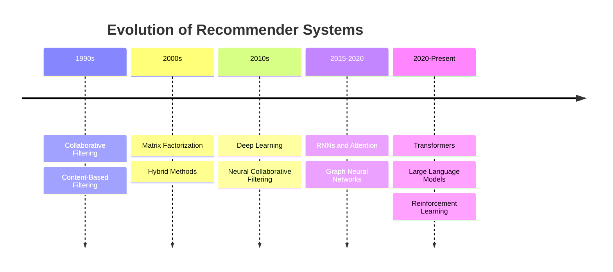
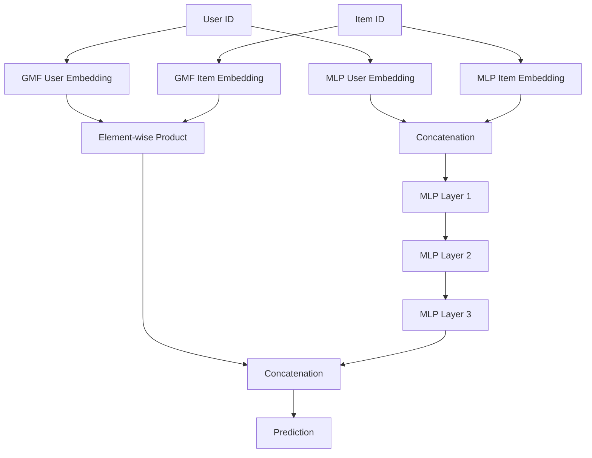
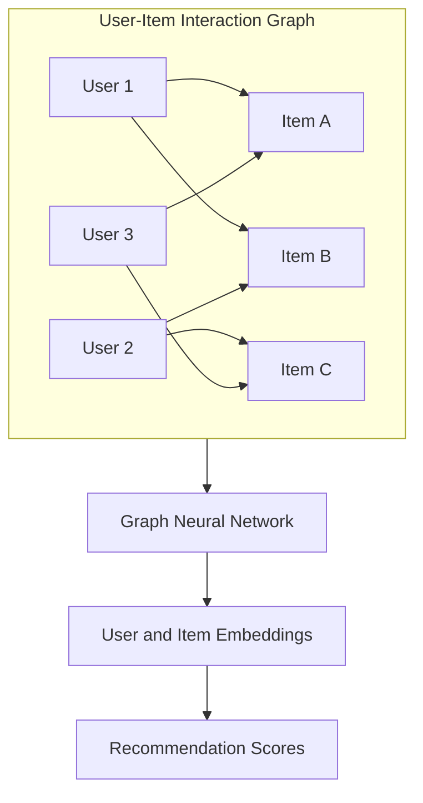
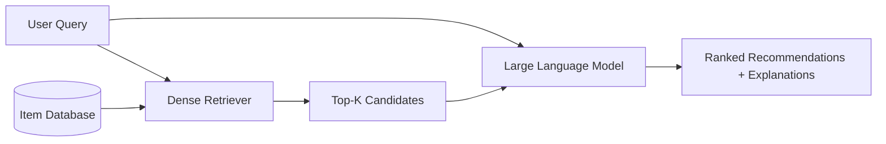
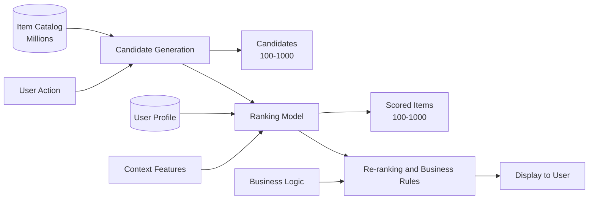

# State-of-the-Art Recommender Systems: A Comprehensive Guide

## Table of Contents

1. [Introduction & Fundamentals](#1-introduction--fundamentals)
   - [What are Recommender Systems?](#what-are-recommender-systems)
   - [Problem Formulation](#problem-formulation)
   - [Evaluation Metrics](#evaluation-metrics)
   - [Evolution Timeline](#evolution-timeline)

2. [Classical Approaches](#2-classical-approaches)
   - [Collaborative Filtering](#collaborative-filtering)
   - [Content-Based Filtering](#content-based-filtering)
   - [Matrix Factorization](#matrix-factorization)
   - [Hybrid Methods](#hybrid-methods)

3. [Deep Learning Era](#3-deep-learning-era)
   - [Neural Collaborative Filtering](#neural-collaborative-filtering)
   - [Deep Autoencoders](#deep-autoencoders)
   - [RNN-Based Sequential Recommendations](#rnn-based-sequential-recommendations)

4. [Modern State-of-the-Art](#4-modern-state-of-the-art)
   - [Transformer-Based Models](#transformer-based-models)
   - [Graph Neural Networks](#graph-neural-networks)
   - [LLM-Based Recommendations](#llm-based-recommendations)
   - [Reinforcement Learning Approaches](#reinforcement-learning-approaches)

5. [Advanced Topics & Challenges](#5-advanced-topics--challenges)
   - [Cold Start Problem](#cold-start-problem)
   - [Diversity and Serendipity](#diversity-and-serendipity)
   - [Explainability and Interpretability](#explainability-and-interpretability)
   - [Bias and Fairness](#bias-and-fairness)
   - [Multi-Objective Optimization](#multi-objective-optimization)

6. [Practical Implementation Considerations](#6-practical-implementation-considerations)
   - [System Architecture](#system-architecture)
   - [Scalability Techniques](#scalability-techniques)
   - [Evaluation and A/B Testing](#evaluation-and-ab-testing)
   - [Industrial Tools and Frameworks](#industrial-tools-and-frameworks)

7. [Future Directions & Conclusion](#7-future-directions--conclusion)
   - [Emerging Trends](#emerging-trends)
   - [Key Takeaways](#key-takeaways)
   - [Learning Path](#learning-path)

8. [References](#8-references)

---

## 1. Introduction & Fundamentals

### What are Recommender Systems?

Recommender systems are information filtering tools that predict user preferences and suggest items that users are likely to be interested in. They have become ubiquitous in modern digital experiences, powering everything from movie suggestions on Netflix to product recommendations on Amazon, music discovery on Spotify, and content feeds on social media platforms.

**Why are they important?**
- **User Experience**: Help users discover relevant content in vast catalogs
- **Business Value**: Drive engagement, increase sales, and improve customer satisfaction
- **Information Overload**: Filter through millions of options to surface the most relevant items
- **Personalization**: Create tailored experiences for individual users

### Problem Formulation

Recommender systems can be formulated in several ways depending on the type of feedback and the prediction task.

#### Types of Feedback

**Explicit Feedback**: Direct ratings provided by users
- Examples: Star ratings (1-5), thumbs up/down, numerical scores
- Pros: Clear signal of user preference
- Cons: Sparse data (users rarely rate items), potential bias

**Implicit Feedback**: Inferred from user behavior
- Examples: Clicks, views, purchases, watch time, skips
- Pros: Abundant data, no extra user effort required
- Cons: Noisy signal, harder to interpret (did they like it or just try it?)

#### Task Types

**Rating Prediction**: Predict the rating a user would give to an item

```math
\hat{r} _{ui} = f(u, i, \text{context})
```

where $\hat{r} _{ui}$ is the predicted rating for user $u$ on item $i$.

**Ranking (Top-N Recommendation)**: Rank items by predicted relevance

```math
\text{rank}(i | u) = f(u, i)
```

The goal is to produce an ordered list of items most relevant to the user.

**Sequential Prediction**: Predict the next item(s) given user history

```math
p(i _{t+1} | i_1, i_2, ..., i_t, u)
```

This formulation considers temporal dynamics and session-based patterns.

### Evaluation Metrics

Choosing the right metrics is crucial for assessing recommender system performance.

#### Rating Prediction Metrics

**Root Mean Square Error (RMSE)**:

```math
\text{RMSE} = \sqrt{\frac{1}{N}\sum_{(u,i) \in \text{Test}}(r _{ui} - \hat{r} _{ui})^2}
```

**Mean Absolute Error (MAE)**:

```math
\text{MAE} = \frac{1}{N}\sum_{(u,i) \in \text{Test}}|r _{ui} - \hat{r} _{ui}|
```

Lower values indicate better performance. MAE is more robust to outliers.

#### Ranking Metrics

**Precision@K**: Fraction of recommended items that are relevant

```math
\text{Precision@K} = \frac{|\text{Relevant Items} \cap \text{Top-K Recommendations}|}{K}
```

**Recall@K**: Fraction of relevant items that are recommended

```math
\text{Recall@K} = \frac{|\text{Relevant Items} \cap \text{Top-K Recommendations}|}{|\text{Relevant Items}|}
```

**Normalized Discounted Cumulative Gain (NDCG@K)**: Considers ranking position

```math
\text{DCG@K} = \sum_{i=1}^{K}\frac{rel_i}{\log_2(i+1)}
```

```math
\text{NDCG@K} = \frac{\text{DCG@K}}{\text{IDCG@K}}
```

where $rel_i$ is the relevance of item at position $i$, and IDCG is the ideal DCG.

**Mean Reciprocal Rank (MRR)**: Average of reciprocal ranks of the first relevant item

```math
\text{MRR} = \frac{1}{|U|}\sum_{u=1}^{|U|}\frac{1}{\text{rank}_u}
```

**Hit Rate@K**: Percentage of users with at least one relevant item in top-K

```math
\text{Hit Rate@K} = \frac{|\{u : |\text{Relevant}_u \cap \text{Top-K}_u| > 0\}|}{|U|}
```

### Evolution Timeline

The field of recommender systems has evolved significantly over the past three decades:



Each era brought new capabilities:
- **1990s**: Foundation with neighborhood-based methods
- **2000s**: Netflix Prize spurred matrix factorization breakthroughs
- **2010s**: Deep learning enabled learning complex patterns
- **2015-2020**: Attention mechanisms and graphs captured relationships
- **2020-Present**: LLMs and RL bring reasoning and optimization capabilities

### Quick Comparison of Major Approaches

| Approach | Data Needed | Scalability | Cold Start | Interpretability | Best For |
|----------|-------------|-------------|------------|------------------|----------|
| **Collaborative Filtering** | User-item interactions | Moderate | Poor | High | Mature platforms with interaction data |
| **Content-Based** | Item features | Good | Good (items) | High | Rich metadata, new items |
| **Matrix Factorization** | User-item interactions | Excellent | Poor | Moderate | Large-scale, sparse data |
| **Neural CF** | User-item interactions | Good | Poor | Low | Non-linear patterns, sufficient data |
| **RNN/Sequential** | Sequential interactions | Moderate | Poor | Low | Session-based, temporal patterns |
| **Transformers** | Sequential interactions | Moderate | Poor | Moderate | Long sequences, context modeling |
| **Graph Neural Networks** | User-item graph | Good | Poor | Low | Relational data, social networks |
| **LLM-Based** | Text descriptions | Moderate | Excellent | High | Cold start, explanations, reasoning |
| **Reinforcement Learning** | Interaction feedback | Good | Moderate | Low | Long-term optimization, exploration |

---

## 2. Classical Approaches

### Collaborative Filtering

Collaborative Filtering (CF) is based on the principle that users who agreed in the past tend to agree in the future. It relies solely on user-item interactions without requiring item features.

#### User-Based Collaborative Filtering

Recommends items liked by similar users.

**Algorithm**:
1. Find users similar to the target user
2. Aggregate ratings from similar users
3. Recommend highly-rated items the target user hasn't seen

**Similarity Metrics**:

**Cosine Similarity**:

```math
\text{sim}(u, v) = \frac{\sum_{i \in I _{uv}} r _{ui} \cdot r _{vi}}{\sqrt{\sum_{i \in I _{uv}} r _{ui}^2} \cdot \sqrt{\sum_{i \in I _{uv}} r _{vi}^2}}
```

**Pearson Correlation**:

```math
\text{sim}(u, v) = \frac{\sum_{i \in I_{uv}} (r_{ui} - \bar{r} _{u}) \cdot (r_{vi} - \bar{r} _{v})}{\sqrt{\sum_{i \in I_{uv}} (r_{ui} - \bar{r} _{u})^2} \cdot \sqrt{\sum_{i \in I_{uv}} (r_{vi} - \bar{r} _{v})^2}}
```

**Prediction Formula**:

```math
\hat{r} _{ui} = \bar{r} _{u} + \frac{\sum_{v \in N(u)} \text{sim}(u,v) \cdot (r_{vi} - \bar{r} _{v})}{\sum_{v \in N(u)} |\text{sim}(u,v)|}
```

where $N(u)$ is the neighborhood of similar users, and $\bar{r} _{u}$ is the average rating of user $u$.

#### Item-Based Collaborative Filtering

Recommends items similar to those the user has liked. Generally more stable than user-based CF.

**Advantages over User-Based**:
- Items are more static than user preferences
- Easier to explain ("You liked X, so you might like Y")
- Better scalability (fewer items than users in many domains)
- More accurate in sparse datasets

**Prediction Formula**:

```math
\hat{r} _{ui} = \frac{\sum_{j \in N(i)} \text{sim}(i,j) \cdot r _{uj}}{\sum_{j \in N(i)} |\text{sim}(i,j)|}
```

#### User-Based vs Item-Based CF

| Aspect | User-Based CF | Item-Based CF |
|--------|---------------|---------------|
| **Similarity Computation** | Between users | Between items |
| **Stability** | Less stable (preferences change) | More stable (items don't change) |
| **Scalability** | Poor (many users) | Better (fewer items) |
| **Sparsity Handling** | Worse | Better |
| **Explanation** | "Users like you..." | "Because you liked..." |
| **Update Frequency** | More frequent | Less frequent |
| **Cold Start** | New users struggle | New items struggle |

#### Limitations

- **Sparsity**: Most users interact with few items, making similarity calculation unreliable
- **Cold Start**: Cannot recommend for new users or new items
- **Scalability**: Computing all pairwise similarities is expensive
- **Popularity Bias**: Tends to recommend popular items
- **Gray Sheep Problem**: Users with unique tastes don't fit any neighborhood

### Content-Based Filtering

Content-based methods recommend items similar to those a user has liked, based on item features.

#### Feature Extraction

**Text Features (TF-IDF)**:

```math
\text{TF-IDF}(t,d) = \text{TF}(t,d) \times \log\frac{N}{\text{DF}(t)}
```

where TF is term frequency, DF is document frequency, and $N$ is total documents.

**Modern Embeddings**:
- Word2Vec, GloVe for text
- ResNet, VGG features for images
- Audio spectrograms for music

#### User Profile Construction

Build a profile representing user preferences:

```math
\text{profile}(u) = \frac{1}{|I_u|}\sum_{i \in I_u} \text{features}(i)
```

or weighted by ratings:

```math
\text{profile}(u) = \frac{\sum_{i \in I_u} r _{ui} \cdot \text{features}(i)}{\sum_{i \in I_u} r _{ui}}
```

#### Recommendation Generation

Compute similarity between user profile and candidate items:

```math
\text{score}(u, i) = \text{sim}(\text{profile}(u), \text{features}(i))
```

**Strengths**:
- No cold start for items (can recommend new items immediately)
- Transparent recommendations (feature-based explanations)
- No need for other users' data

**Weaknesses**:
- Limited to hand-crafted features
- Over-specialization (filter bubble)
- Cannot discover new interests
- Cold start for new users

### Matrix Factorization

Matrix factorization decomposes the user-item interaction matrix into lower-dimensional user and item representations.

#### Core Idea

Approximate the rating matrix $R \in \mathbb{R}^{m \times n}$ as:

```math
R \approx P^T Q
```

where $P \in \mathbb{R}^{k \times m}$ represents user factors and $Q \in \mathbb{R}^{k \times n}$ represents item factors, with $k \ll \min(m,n)$.

**Basic Prediction**: $\hat{r}_{ui} = p_u^T q_i$

**With Bias Terms** (more accurate in practice): $\hat{r}_{ui} = \mu + b_u + b_i + p_u^T q_i$

#### Singular Value Decomposition (SVD)

Classical approach using matrix decomposition. SVD factorizes the rating matrix into three matrices:

**Classical SVD (for complete matrices)**:

```math
R = U\Sigma V^T
```

**SVD with Bias Terms (practical recommender systems)**:

```math
\hat{r}_{ui} = \mu + b_u + b_i + U_{u,:} \Sigma V^T_{:,i}
```

where:
- $R \in \mathbb{R}^{m \times n}$: Original user-item rating matrix (m users, n items)
- $\mu$: Global mean rating
- $b_u$: Bias for user $u$
- $b_i$: Bias for item $i$
- $U \in \mathbb{R}^{m \times k}$: Left singular vectors (user feature matrix)
- $\Sigma \in \mathbb{R}^{k \times k}$: Diagonal matrix of singular values (strength of latent factors)
- $V^T \in \mathbb{R}^{k \times n}$: Right singular vectors transposed (item feature matrix)
- $k$: Number of latent factors (typically $k \ll \min(m, n)$)

**Interpretation**:
- Each row of $U$ represents a user in the $k$-dimensional latent space
- Each column of $V^T$ represents an item in the $k$-dimensional latent space
- The diagonal entries $\sigma_1, \sigma_2, ..., \sigma_k$ in $\Sigma$ (singular values) capture the importance of each latent factor
- **Basic prediction**: $\hat{r} _{ui} = U _{u,:} \Sigma V^T _{:,i}$
- **With biases**: $\hat{r} _{ui} = \mu + b_u + b_i + U _{u,:} \Sigma V^T _{:,i}$

**Practical Approach**:
1. Compute biases: $\mu$, $b_u$, $b_i$
2. Center the data: $r'_{ui} = r_{ui} - \mu - b_u - b_i$
3. Apply SVD to the centered residuals: $R' \approx U\Sigma V^T$
4. Predictions combine biases and latent factors

**Challenge**: SVD requires a complete matrix, but recommender data is sparse.

**Solution**: Optimize only on observed ratings (leads to optimization-based approaches below).

#### Optimization-Based Approach

**Loss Function**:

```math
\mathcal{L} = \sum_{(u,i) \in \mathcal{O}} (r _{ui} - p_u^T q_i)^2 + \lambda(||p_u||^2 + ||q_i||^2)
```

where $\mathcal{O}$ is the set of observed ratings, and $\lambda$ is the regularization parameter.

**Alternating Least Squares (ALS)**:

```python
# Pseudo-code for ALS
def als_matrix_factorization(R, k, lambda_reg, iterations):
    # Initialize user and item factors randomly
    P = np.random.rand(k, num_users)
    Q = np.random.rand(k, num_items)
    
    for iteration in range(iterations):
        # Fix Q, optimize P
        for u in range(num_users):
            rated_items = get_rated_items(u)
            Q_u = Q[:, rated_items]
            r_u = R[u, rated_items]
            P[:, u] = np.linalg.solve(
                Q_u @ Q_u.T + lambda_reg * np.eye(k),
                Q_u @ r_u
            )
        
        # Fix P, optimize Q
        for i in range(num_items):
            users_rated = get_users_rated(i)
            P_i = P[:, users_rated]
            r_i = R[users_rated, i]
            Q[:, i] = np.linalg.solve(
                P_i @ P_i.T + lambda_reg * np.eye(k),
                P_i @ r_i
            )
    
    return P, Q
```

#### Bias Terms in Matrix Factorization

In practice, incorporating bias terms significantly improves prediction accuracy by capturing systematic tendencies in the data.

**Baseline Prediction Model**:

```math
\hat{r}_{ui} = \mu + b_u + b_i + p_u^T q_i
```

where:
- $\mu$: Global mean rating (overall average across all ratings)
- $b_u$: User bias (user $u$'s tendency to rate above/below average)
- $b_i$: Item bias (item $i$'s tendency to be rated above/below average)
- $p_u^T q_i$: User-item interaction (captures user preferences for specific item characteristics)

**Motivation**:
- **User Bias**: Some users are consistently generous (rate everything high), others are critical (rate everything low)
- **Item Bias**: Some items are universally loved (high quality), others are universally disliked (poor quality)
- **Interaction Term**: Captures the specific match between user preferences and item characteristics beyond these baseline effects

**Example Interpretation**:
```
User Alice: b_Alice = +0.5 (rates 0.5 stars higher than average)
Movie "The Godfather": b_Godfather = +1.2 (rated 1.2 stars higher than average)
Global mean: μ = 3.5

Baseline prediction: 3.5 + 0.5 + 1.2 = 5.2 stars
Plus interaction term: 5.2 + p_Alice^T q_Godfather
```

**Loss Function with Bias Terms**:

```math
\mathcal{L} = \sum_{(u,i) \in \mathcal{O}} (r_{ui} - \mu - b_u - b_i - p_u^T q_i)^2 + \lambda(||p_u||^2 + ||q_i||^2 + b_u^2 + b_i^2)
```

**Optimization**: Can be learned via gradient descent or incorporated into ALS updates.

**SGD Update Rules**:
```math
p_u \leftarrow p_u + \alpha(e_{ui} \cdot q_i - \lambda \cdot p_u)
```

```math
q_i \leftarrow q_i + \alpha(e_{ui} \cdot p_u - \lambda \cdot q_i)
```

```math
b_u \leftarrow b_u + \alpha(e_{ui} - \lambda \cdot b_u)
```

```math
b_i \leftarrow b_i + \alpha(e_{ui} - \lambda \cdot b_i)
```

where $e_{ui} = r_{ui} - \hat{r}_{ui}$ is the prediction error, and $\alpha$ is the learning rate.

**Benefits**:
- Better captures rating patterns
- Reduces error by 5-10% compared to basic MF
- More interpretable (can identify "easy raters" vs "harsh critics")
- Foundation for SVD++ and other advanced methods

#### Probabilistic Matrix Factorization (PMF)

Bayesian approach with Gaussian priors:

```math
p(R|P,Q,\sigma^2) = \prod_{(u,i) \in \mathcal{O}} \mathcal{N}(r _{ui} | p_u^T q_i, \sigma^2)
```

**Advantages of Matrix Factorization**:
- Handles sparsity well
- Scalable with efficient algorithms
- Captures latent factors (e.g., genres, styles)
- Strong empirical performance (won Netflix Prize)

**Extensions**:
- SVD++: Incorporates implicit feedback
- TimeSVD++: Adds temporal dynamics
- Factorization Machines: Generalizes to multiple feature types

### Hybrid Methods

Combine multiple recommendation approaches to leverage their complementary strengths.

#### Hybridization Strategies

**Weighted Hybrid**:

```math
\text{score}(u,i) = \alpha \cdot \text{score} _{\mathrm{CF}}(u,i) + (1-\alpha) \cdot \text{score} _{\mathrm{CB}}(u,i)
```

**Switching Hybrid**:
Use different methods based on context (e.g., content-based for new items, CF for existing items).

**Cascade Hybrid**:
Refine recommendations progressively (e.g., CF generates candidates, content-based filters/ranks).

**Feature Combination**:
Combine features from different sources into a single model (e.g., neural networks).

**Meta-Level Hybrid**:
Use output of one method as input to another (e.g., content-based builds user profile, CF uses these profiles).

#### When to Use Each Strategy

| Strategy | Best For | Example Use Case |
|----------|----------|------------------|
| Weighted | Stable performance across scenarios | General-purpose recommendations |
| Switching | Handling cold start | New items → content-based, others → CF |
| Cascade | Large catalogs | CF for candidates, content-based for re-ranking |
| Feature Combination | Rich feature sets | Deep learning with multiple data sources |
| Meta-Level | Transfer learning | Cross-domain recommendations |

---

## 3. Deep Learning Era

Deep learning revolutionized recommender systems by enabling the learning of complex, non-linear patterns from data without extensive feature engineering.

### Neural Collaborative Filtering

Neural Collaborative Filtering (NCF) replaces the dot product in matrix factorization with neural networks to learn user-item interactions.

#### Generalized Matrix Factorization (GMF)

Neural interpretation of matrix factorization:

```math
\hat{r} _{ui} = a _{\mathrm{out}}(h^{T}(p _{u} \odot q _{i}))
```

where $\odot$ is element-wise product, $h$ is the edge weights, and $a_{out}$ is the output activation.

#### Multi-Layer Perceptron (MLP)

Learn interactions through hidden layers:

```math
z_1 = \phi_1(p_u, q_i) = [p_u, q_i]
```

```math
z_2 = a_2(W_2^T z_1 + b_2)
```

```math
\vdots
```

```math
z_L = a_L(W_L^T z _{L-1} + b_L)
```

```math
\hat{r} _{ui} = \sigma(h^T z_L)
```

#### NeuMF: Fusion Model

Combines GMF and MLP to capture both linear and non-linear patterns:



**Training**:
- Loss function: Binary cross-entropy for implicit feedback

```math
\mathcal{L} = -\sum_{(u,i,y) \in \mathcal{T}} \left[ y \log \hat{y} _{ui} + (1-y)\log(1-\hat{y} _{ui}) \right]
```

**Key Insights**:
- Separate embeddings for GMF and MLP paths improve performance
- Pre-training each component helps convergence
- Non-linearity captures complex patterns missed by dot product

### Deep Autoencoders

Autoencoders compress input into latent representations, useful for collaborative filtering with sparse data.

#### AutoRec

Neural autoencoder-based CF with two variants:

**Item-Based AutoRec (I-AutoRec)**:

```math
h(r^{(i)}; \theta) = f(W \cdot g(V r^{(i)} + \mu) + b)
```

where $r^{(i)}$ is the rating vector for item $i$, and $f, g$ are activation functions.

**Objective**:

```math
\min_{\theta} \sum_{i=1}^n ||r^{(i)} - h(r^{(i)}; \theta)|| _2^2 + \frac{\lambda}{2}(||W|| _F^2 + ||V|| _F^2)
```

**User-Based AutoRec (U-AutoRec)**: Similar, but encodes user rating vectors.

#### Denoising Autoencoders

Add noise to input and train to reconstruct original:

```math
\tilde{r} = r + \epsilon, \quad \epsilon \sim \mathcal{N}(0, \sigma^2)
```

**Benefits**:
- More robust representations
- Better generalization
- Handles missing data naturally

#### Variational Autoencoders (VAE)

Probabilistic autoencoders with latent variable modeling:

**Encoder**: $q_\phi(z|r_u) = \mathcal{N}(z; \mu_\phi(r_u), \sigma_\phi^2(r_u))$

**Decoder**: $p_\theta(r_u|z) = \text{Multinomial}(r_u; \pi_\theta(z))$

**ELBO Loss**:

```math
\mathcal{L} = -\mathbb{E} _{q _{\phi}(z|r _{u})}[\log p _{\theta}(r _{u}|z)] + \text{KL}(q _{\phi}(z|r _{u}) \| p(z))
```

**Mult-VAE**: Uses multinomial likelihood for implicit feedback, achieving state-of-the-art results on many benchmarks.

### RNN-Based Sequential Recommendations

Sequential models capture temporal patterns and session-based behavior.

#### GRU4Rec

First RNN-based session recommendation system using Gated Recurrent Units:


**Model**:

```math
h_t = \text{GRU}(x_t, h _{t-1})
```

```math
\hat{y}_t = \text{softmax}(W h_t + b)
```

where $x_t$ is the embedding of item at step $t$, and $\hat{y}_t$ is the prediction distribution.

#### Session-Based Recommendation

**Challenge**: No long-term user history, only current session data.

**Solution**: Treat each session independently, predict next action.

#### Ranking Loss Functions

**Bayesian Personalized Ranking (BPR)**:

```math
\mathcal{L} _{\mathrm{BPR}} = -\sum_{(i,j) \in D _{s}} \log \sigma(\hat{r} _{si} - \hat{r} _{sj})
```

where item $i$ is observed in session $s$, and $j$ is a negative sample.

**TOP1 Loss** (relative ranking):

```math
\mathcal{L} _{\mathrm{TOP1}} = \sum_{j \in S} \left[ \sigma(\hat{r} _{sj} - \hat{r} _{si}) + \sigma(\hat{r} _{sj}^{2}) \right]
```

**TOP1-max** (simplified):

```math
\mathcal{L} _{\mathrm{TOP1\text{-}max}} = \sigma\left(\max_{j \in S}(\hat{r} _{sj}) - \hat{r} _{si}\right)
```

#### Extensions

**Hierarchical RNNs**: Model both session-level and user-level patterns
**Attention-based RNNs**: Focus on relevant past items
**NARM** (Neural Attentive Recommendation Machine): Combines global and local intent

**Key Advantages**:
- Captures sequential patterns
- Handles variable-length sessions
- No feature engineering needed
- Works for anonymous users

**Limitations**:
- Training complexity with large item catalogs
- Difficulty capturing long-term dependencies
- Solved by attention mechanisms (next section)

### Deep Learning Methods Comparison

| Method | Architecture | Input | Output | Key Strength | Main Limitation |
|--------|--------------|-------|--------|--------------|-----------------|
| **NCF/NeuMF** | MLP + GMF | User/Item IDs | Rating/Score | Non-linear interactions | Doesn't use sequential info |
| **AutoRec** | Autoencoder | Rating vector | Reconstructed ratings | Handles sparsity well | No sequential modeling |
| **VAE** | Variational AE | Rating vector | Rating distribution | Probabilistic, robust | Complex training |
| **GRU4Rec** | RNN/GRU | Item sequence | Next item | Sequential patterns | Long-term dependency issues |

---

## 4. Modern State-of-the-Art

### Transformer-Based Models

Transformers brought self-attention mechanisms to sequential recommendations, enabling better long-range dependency modeling.

#### Self-Attention Mechanism Recap

Self-attention computes attention weights for all positions simultaneously:

**Query, Key, Value**:

```math
Q = XW_Q, \quad K = XW_K, \quad V = XW_V
```

**Scaled Dot-Product Attention**:

```math
\text{Attention}(Q,K,V) = \text{softmax}\left(\frac{QK^T}{\sqrt{d_k}}\right)V
```

**Multi-Head Attention** allows learning different aspects:

```math
\text{MultiHead}(Q,K,V) = \text{Concat}(\text{head}_1, ..., \text{head}_h)W_O
```

#### BERT4Rec: Bidirectional Encoder for Sequential Recommendations

Adapts BERT's masked language model approach to recommendation.

**Key Innovation**: Bidirectional context for better representation learning.

**Architecture**:
```python
# Pseudo-code for BERT4Rec
def bert4rec(user_sequence, mask_prob=0.15):
    # Input: [item_1, item_2, ..., item_t]
    
    # Random masking
    masked_seq = apply_random_mask(user_sequence, mask_prob)
    # Result: [item_1, [MASK], item_3, ..., [MASK]]
    
    # Embedding layer
    embeddings = item_embedding(masked_seq) + position_embedding
    
    # Transformer encoder layers
    for layer in transformer_layers:
        embeddings = multi_head_attention(embeddings)
        embeddings = feed_forward(embeddings)
    
    # Predict masked items
    predictions = output_layer(embeddings)
    return predictions
```

**Training Objective (Cloze Task)**:

```math
\mathcal{L} = -\sum_{m \in \mathcal{M}} \log P(v_m = v_m^* | S_\mathcal{M})
```

where $\mathcal{M}$ is the set of masked positions, $v_m^*$ is the true item, and $S_\mathcal{M}$ is the masked sequence.

**Masking Strategy**:
- Randomly mask 15% of items
- 80% replace with [MASK]
- 10% replace with random item
- 10% keep original (prevents overfitting to [MASK])

**Benefits**:
- Bidirectional context captures richer patterns
- Can be pre-trained on large datasets
- Robust to noise in sequence

#### SASRec: Self-Attentive Sequential Recommendation

Unidirectional self-attention for left-to-right modeling.

**Model Architecture**:

```math
\text{SASRec}(S) = F_1(F_2(...F_L(E)))
```

where $E$ is the embedding matrix, and $F_l$ is the $l$-th self-attention block.

**Causal Self-Attention**:
Uses masking to prevent attending to future items:

```math
\text{Attention}(Q,K,V) = \text{softmax}\left(\frac{QK^T + M}{\sqrt{d}}\right)V
```

where $M _{ij} = -\infty$ if $i < j$ (future positions).

**Prediction**:

```math
p(i | S_u) = \frac{\exp(r_i^T F(S_u))}{\sum_{i' \in \mathcal{I}} \exp(r _{i'}^T F(S_u))}
```

**Comparison: BERT4Rec vs SASRec**:

| Aspect | BERT4Rec | SASRec |
|--------|----------|--------|
| Attention | Bidirectional | Unidirectional (causal) |
| Training | Cloze task (predict masked) | Next-item prediction |
| Inference | Single forward pass | Sequential generation |
| Use Case | When past and future context available | Real-time recommendation |
| Performance | Slightly better offline | Faster inference |

#### BST: Behavior Sequence Transformer

Extends transformers with other features (e.g., user demographics, item features).

**Architecture**:
- Transformer encoder for behavior sequence
- Additional features concatenated with sequence output
- MLP for final prediction

**Key Contribution**: Shows how to integrate sequential and non-sequential features.

### Graph Neural Networks

GNNs model user-item interactions as graphs, enabling message passing to learn embeddings.

#### Why Graphs for Recommendations?

**User-Item Bipartite Graph**:


**Advantages**:
- Capture high-order connectivity (users similar to similar users)
- Natural representation of collaborative signal
- Enable inductive learning (generalize to new nodes)

#### LightGCN: Simplified GCN for Collaborative Filtering

Removes unnecessary complexity from GCNs for better recommendation performance.

**Key Insight**: Feature transformations and non-linear activations hurt performance in CF.

**Layer-wise Propagation**:

```math
e _{u}^{(k+1)} = \sum_{i \in \mathcal{N} _{u}} \frac{1}{\sqrt{|\mathcal{N} _{u}||\mathcal{N} _{i}|}} e _{i}^{(k)}
```

```math
e _{i}^{(k+1)} = \sum_{u \in \mathcal{N} _{i}} \frac{1}{\sqrt{|\mathcal{N} _{i}||\mathcal{N} _{u}|}} e _{u}^{(k)}
```

where $\mathcal{N} _{u}$ is the set of items interacted by user $u$.

**Layer Combination**:

```math
e_u = \sum_{k=0}^K \alpha_k e_u^{(k)}, \quad e_i = \sum_{k=0}^K \alpha_k e_i^{(k)}
```

Typically $\alpha_k = \frac{1}{K+1}$ (uniform weighting).

**Prediction**:

```math
\hat{y} _{ui} = e_u^T e_i
```

**Matrix Form** (efficient computation):

```math
E^{(k+1)} = (D^{-1/2}AD^{-1/2})E^{(k)}
```

where $A$ is the adjacency matrix and $D$ is the degree matrix.

**Loss Function** (BPR):

```math
\mathcal{L} = -\sum_{(u,i,j) \in \mathcal{O}} \ln \sigma(\hat{y} _{ui} - \hat{y} _{uj}) + \lambda\|E^{(0)}\|^{2}
```

**Why It Works**:
- Symmetric normalization prevents scale issues
- Multiple layers capture collaborative signal propagation
- Simple design → easy to scale

#### PinSage: GCN at Pinterest Scale

Industrial-scale GNN recommendation system.

**Challenge**: Billion-node graphs don't fit in memory.

**Solutions**:

**1. Node-wise Sampling**:
- Random walk to sample neighborhood
- Importance pooling instead of mean pooling

```math
z_v = \sigma(W \cdot \text{CONCAT}(z_v^{(k-1)}, \text{POOL}(\{z_u^{(k-1)}, \forall u \in \mathcal{N}(v)\})))
```

**2. Efficient Training**:
- Producer-consumer architecture
- GPU for training, CPU for sampling
- Hard negative sampling (items close in embedding space)

**3. MapReduce Inference**:
- Precompute embeddings offline
- Serve with approximate nearest neighbors

**Impact**: 
- Powers "Related Pins" at Pinterest
- 150M+ user actions weekly
- Billions of recommendations daily

#### NGCF: Neural Graph Collaborative Filtering

Explicitly models high-order connectivity through embedding propagation.

**Message Construction**:

```math
m _{u \leftarrow i} = \frac{1}{\sqrt{|\mathcal{N}_u||\mathcal{N}_i|}}(W_1 e_i + W_2(e_i \odot e_u))
```

**Message Aggregation**:

```math
e _{u}^{(k)} = \text{LeakyReLU}\left(m _{u \leftarrow u} + \sum_{i \in \mathcal{N} _{u}} m _{u \leftarrow i}\right)
```

**Feature Interaction**: $e_i \odot e_u$ explicitly models user-item interaction.

**Final Representation**:

```math
e_u^* = e_u^{(0)} || e_u^{(1)} || ... || e_u^{(K)}
```

#### GNN Methods Comparison

| Method | Key Innovation | Message Passing | Scalability | Best For |
|--------|----------------|-----------------|-------------|----------|
| **LightGCN** | Simplified GCN (no transformations) | Symmetric normalization | Excellent | General CF, clean design |
| **PinSage** | Node sampling, MapReduce | Random walk sampling | Billion-scale | Industrial applications |
| **NGCF** | Explicit user-item interaction | Feature interaction term | Moderate | Rich interaction modeling |

### LLM-Based Recommendations

Large Language Models represent a paradigm shift: treating recommendations as language understanding and generation tasks.

#### Paradigm Shift: Recommendations as Language Tasks

**Traditional**: Learn embedding space from user-item interactions
**LLM-Based**: Formulate as text input/output with natural language understanding

**Advantages**:
- Rich semantic understanding of items
- Natural explanations
- Zero-shot generalization
- Handle cold start better (use item descriptions)

#### Prompting Strategies

**Zero-Shot Recommendations**:
```
Prompt: "Given a user who has watched the following movies:
1. The Matrix (1999) - Sci-fi action
2. Inception (2010) - Mind-bending thriller
3. Interstellar (2014) - Space exploration

Recommend 5 movies this user might enjoy and explain why."

GPT-4 Response: 
1. Blade Runner 2049 - Similar cyberpunk themes to The Matrix...
2. Tenet - Christopher Nolan's time-bending concept like Inception...
[etc.]
```

**Few-Shot In-Context Learning**:
```
Prompt: "Here are examples of user preferences and recommendations:

User A liked: [Item1, Item2, Item3] → Recommended: [Item4]
User B liked: [Item5, Item6, Item7] → Recommended: [Item8]

Now, User C liked: [Item9, Item10, Item11] → Recommended: ?"
```

**Chain-of-Thought Reasoning**:
```
Prompt: "Let's think step by step about what this user might like:
1. Analyze their preferences
2. Identify common themes
3. Consider related genres
4. Recommend similar items with explanation"
```

#### Fine-Tuning Approaches

**P5: Pretrain, Personalize, Prompt, and Predict Paradigm**

Unified text-to-text framework for recommendations:

**Task Formulation**:
```
Input: "User has rated: Star Wars 5, Lord of the Rings 5. 
        Will user rate Harry Potter highly?"
Output: "Yes, rating: 5"
```

**Multiple Task Types**:
- Rating prediction: "Rate [Item] for [User]"
- Sequential: "What's next after [Item1], [Item2]?"
- Explanation: "Why recommend [Item] to [User]?"
- Review generation: "Generate review for [User] on [Item]"

**Training**: Fine-tune T5/BART on recommendation datasets formatted as text.

**TALLRec: Temporal Augmented LLM for Recommendations**

Enhances LLMs with temporal awareness:
- Time-aware prompts: "Recently watched...", "In the past month..."
- Recency weighting in context
- Temporal reasoning: "User's preferences shifted from action to drama"

**Instruction Tuning**:
Fine-tune LLMs with instruction-following examples:
```
Instruction: "Recommend items for a user who prefers comedy movies"
Input: User history: [Movie1, Movie2, ...]
Output: [Recommended items with explanations]
```

#### Retrieval-Augmented Generation (RAG)

Combine retrieval systems with LLMs:



**Workflow**:
1. **Retrieve**: Dense retrieval (e.g., BERT embeddings) finds candidates
2. **Augment**: Add item metadata to prompt context
3. **Generate**: LLM ranks, filters, and explains recommendations

**Benefits**:
- Scalability (retrieval handles millions of items)
- Interpretability (LLM provides reasoning)
- Flexibility (easy to add business constraints)

#### Challenges

**Computational Cost**:
- LLMs require significant inference resources
- Solution: Use LLMs for re-ranking, not candidate generation

**Hallucination**:
- May recommend non-existent items
- Solution: Constrained generation, retrieval-based grounding

**Consistency**:
- Different prompts → different results
- Solution: Prompt engineering, temperature tuning

**Cold Start Advantages**:
- Can leverage item descriptions for new items
- Understand user intent from natural language
- Transfer knowledge from pre-training

### Reinforcement Learning Approaches

RL formulates recommendations as sequential decision-making, optimizing long-term user engagement.

#### Formulating Recommendations as RL

**Components**:
- **State** $s_t$: User's current context (history, profile, session state)
- **Action** $a_t$: Recommend item (or slate of items)
- **Reward** $r_t$: User feedback (click, time spent, purchase)
- **Policy** $\pi(a|s)$: Recommendation strategy
- **Goal**: Maximize cumulative reward $\sum_{t} \gamma^t r_t$

**Why RL?**
- Optimize long-term engagement, not just immediate clicks
- Handle exploration-exploitation tradeoff
- Adapt to changing user preferences
- Model dynamics: recommendations influence future preferences

#### Deep Q-Network (DQN) for Recommendations

Learn action-value function: $Q(s,a)$ = expected return from taking action $a$ in state $s$.

**Architecture**:
```python
# Pseudo-code for DQN recommender
class DQNRecommender:
    def __init__(self, state_dim, num_items, embedding_dim):
        self.q_network = NeuralNetwork(state_dim, num_items)
        self.target_network = copy(self.q_network)
        self.replay_buffer = ReplayBuffer()
    
    def select_action(self, state, epsilon):
        if random() < epsilon:  # Exploration
            return random_item()
        else:  # Exploitation
            q_values = self.q_network(state)
            return argmax(q_values)
    
    def update(self, batch):
        states, actions, rewards, next_states = batch
        
        # Compute target Q-values
        with torch.no_grad():
            max_next_q = self.target_network(next_states).max(dim=1)
            target_q = rewards + gamma * max_next_q
        
        # Compute current Q-values
        current_q = self.q_network(states).gather(1, actions)
        
        # Loss and backprop
        loss = F.mse_loss(current_q, target_q)
        loss.backward()
```

**Handling Large Action Spaces**:
- **Candidate generation**: Use CF/GNN to generate ~100 candidates
- **Q-value estimation**: Evaluate Q-values only for candidates
- **Approximate methods**: Learn action embeddings

**Experience Replay**: Store $(s, a, r, s')$ tuples, sample mini-batches for training
- Breaks correlation between consecutive samples
- Improves data efficiency

#### Actor-Critic Methods

Separate policy network (actor) and value network (critic).

**DDPG (Deep Deterministic Policy Gradient)**:

**Actor**: $\mu(s; \theta^\mu)$ learns deterministic policy
**Critic**: $Q(s,a; \theta^Q)$ evaluates state-action pairs

**Actor Update**:

```math
\nabla _{\theta^{\mu}} J \approx \mathbb{E}\left[\nabla _{a} Q(s,a; \theta^{Q})| _{a=\mu(s)} \nabla _{\theta^{\mu}} \mu(s; \theta^{\mu})\right]
```

**Slate Recommendations**:
Recommend multiple items simultaneously considering:
- Diversity
- Position bias
- Inter-item relationships

**Slate-MDP**: State includes slate position, action is entire slate

#### Contextual Bandits

Simplified RL: no state transitions, immediate reward only.

**Problem**: At each round, choose action $a$ based on context $x$, receive reward $r$.

**LinUCB (Linear Upper Confidence Bound)**:

**Model**: $r = x^T \theta_a + \epsilon$

**Estimate**: $\hat{\theta}_a = A_a^{-1}b_a$

where $A_a = \sum x_i x_i^T + I$, $b_a = \sum r_i x_i$

**Selection** (UCB):

```math
a_t = \arg\max_a \left( x_t^T \hat{\theta}_a + \alpha \sqrt{x_t^T A_a^{-1} x_t} \right)
```

The second term encourages exploration of uncertain actions.

**Thompson Sampling**:
Sample from posterior distribution:

```math
\theta_a \sim \mathcal{N}(\hat{\theta}_a, A_a^{-1})
```

```math
a_t = \arg\max_a x_t^T \theta_a
```

**Neural Bandits**: Replace linear model with neural network.

#### Multi-Armed Bandits for A/B Testing

**Problem**: Test multiple recommendation algorithms, minimize regret.

**ε-greedy**: 
- Exploit best arm with probability $1-\epsilon$
- Explore random arm with probability $\epsilon$

**UCB**:

```math
a_t = \arg\max_a \left( \bar{r}_a + \sqrt{\frac{2\ln t}{n_a}} \right)
```

where $\bar{r}_a$ is average reward, $n_a$ is times arm pulled.

**Practical Use**:
- A/B testing with minimal regret
- Adaptive traffic allocation
- Personalized A/B testing (contextual bandits)

#### Real-World Deployment Considerations

**Exploration-Exploitation Balance**:
- Too much exploration → poor user experience
- Too little → miss better strategies
- Solution: Conservative exploration, off-policy learning

**Off-Policy Learning**:
Train on historical data (from previous policy):
- Importance sampling to correct distribution shift
- Doubly robust estimation

**Batch Updates**:
- Can't update policy in real-time
- Train offline on logged data
- Update periodically (daily/weekly)

**Evaluation Challenges**:
- Counterfactual evaluation: what would have happened?
- Off-policy evaluation metrics
- A/B testing for final validation

**Safety Constraints**:
- Bounded experimentation
- Fallback to safe policy
- Filter inappropriate recommendations

#### RL Methods Comparison

| Method | State Space | Action Space | Exploration | Complexity | Best For |
|--------|-------------|--------------|-------------|------------|----------|
| **DQN** | Discrete | Discrete | ε-greedy | High | Discrete item sets |
| **DDPG** | Continuous | Continuous | Noise | Very High | Continuous actions, slates |
| **LinUCB** | Contextual | Discrete | UCB | Low | Fast online learning |
| **Thompson Sampling** | Contextual | Discrete | Posterior sampling | Low | Bayesian approach |
| **Multi-Armed Bandit** | Stateless | Discrete | Various | Very Low | A/B testing, simple |

---

## 5. Advanced Topics & Challenges

### Cold Start Problem

The cold start problem occurs when there's insufficient data for new users, items, or entire systems.

#### Types of Cold Start

**User Cold Start**: New user with no interaction history
- Can't compute user-based CF similarities
- No data to learn user preferences

**Item Cold Start**: New item with no ratings/interactions
- Can't compute item-based CF similarities
- Difficult to gauge popularity or quality

**System Cold Start**: Entirely new platform
- No user-item interactions at all
- Need to bootstrap recommendations

#### Solutions

**Content-Based Features**:
- Use item metadata (genre, description, price)
- User demographics (age, location, gender)
- Works immediately but limited by feature quality

**Hybrid Approaches**:
- Start with content-based, transition to CF as data accumulates
- Weighted combination based on data availability

**Transfer Learning**:
- Pre-train on related domains
- Fine-tune on target domain
- Example: Transfer movie knowledge to TV show recommendations

**Meta-Learning**:
- Learn to quickly adapt to new users/items with few examples
- "Learning to learn" from similar past scenarios
- MAML (Model-Agnostic Meta-Learning) for recommendations

**Active Learning**:
- Strategically ask users questions to gather maximum information
- Ask about popular/diverse items
- Preference elicitation through comparisons

**LLMs for Cold Start**:
- Generate embeddings from item descriptions
- Understand user intent from natural language
- Zero-shot recommendations based on textual understanding

**Example Strategy**:
```python
def recommend_cold_start(user):
    if user.num_interactions == 0:
        # Pure cold start - use demographics
        return demographic_based_recommendations(user)
    elif user.num_interactions < 5:
        # Warm start - hybrid approach
        cf_recs = collaborative_filtering(user, weight=0.3)
        cb_recs = content_based(user, weight=0.7)
        return merge(cf_recs, cb_recs)
    else:
        # Sufficient data - full CF
        return collaborative_filtering(user)
```

### Diversity and Serendipity

Optimizing only for accuracy can lead to filter bubbles and boring recommendations.

#### Why Diversity Matters

**Business Perspective**:
- Showcase catalog breadth
- Help users discover new interests
- Reduce over-dependence on popular items

**User Perspective**:
- Avoid repetitive recommendations
- Discover unexpected interests
- More engaging experience

#### Measuring Diversity

**Intra-List Diversity** (within a recommendation list):

```math
\text{ILD} = \frac{2}{K(K-1)} \sum_{i=1}^{K-1} \sum_{j=i+1}^{K} (1 - \text{sim}(i,j))
```

**Coverage** (catalog breadth):

```math
\text{Coverage} = \frac{|\text{Items Recommended}|}{|\text{Total Items}|}
```

**Gini Index** (equality of recommendation distribution):

```math
\text{Gini} = \frac{\sum_{i=1}^n (2i - n - 1) \cdot \text{freq}(i)}{n \sum_{i=1}^n \text{freq}(i)}
```

Lower Gini → more equal distribution.

#### Techniques for Diversity

**Maximal Marginal Relevance (MMR)**:
Select items balancing relevance and diversity:

```math
\text{MMR} = \arg\max_{i \in C \setminus S} [\lambda \cdot \text{Rel}(i) - (1-\lambda) \cdot \max_{j \in S} \text{Sim}(i,j)]
```

where $C$ is candidates, $S$ is already selected, $\lambda$ balances relevance vs diversity.

**Determinantal Point Processes (DPP)**:
Probabilistic model favoring diverse subsets:

```math
P(Y) \propto \det(L_Y)
```

where $L$ is a kernel matrix encoding quality and similarity.
- Large determinant → high quality, high diversity
- Elegant mathematical framework
- Efficient inference algorithms exist

**Post-Filtering**:
1. Generate over-complete candidate set (top-2K)
2. Re-rank with diversity constraint
3. Return diverse top-K

**Multi-Objective Optimization**:
Jointly optimize accuracy and diversity:

```math
\mathcal{L} = \mathcal{L} _{\mathrm{accuracy}} + \alpha \cdot \mathcal{L} _{\mathrm{diversity}}
```

#### Serendipity

**Definition**: Surprising yet relevant recommendations (unexpected discoveries).

**Formulation**:

```math
\text{Serendipity}(i) = \text{Relevance}(i) \times \text{Unexpectedness}(i)
```

**Measuring Unexpectedness**:
- Distance from user's typical preferences
- Novelty (rarely recommended items)
- Dissimilarity from profile

**Encouraging Serendipity**:
- Random exploration
- Cross-domain recommendations
- Collaborative signals from diverse users

### Explainability and Interpretability

Users are more likely to engage with recommendations they understand and trust.

#### Why Explainability Matters

- **Trust**: Users trust recommendations with clear reasoning
- **Transparency**: Understanding what data is used
- **Control**: Users can correct misunderstandings
- **Debugging**: Developers can identify model issues
- **Compliance**: GDPR "right to explanation"

#### Explanation Types

**User-Based**: "Users like you also liked..."
**Item-Based**: "Because you watched X, we recommend Y"
**Feature-Based**: "Recommended because it has [features]"
**Review-Based**: "Users praised its [aspects]"
**Counterfactual**: "If you hadn't watched X, we wouldn't recommend Y"

#### Techniques

**Attention-Based Explanations**:
Visualize attention weights from transformer models:
- Which past items influenced the recommendation?
- Which item features were most important?

```python
# Extract attention weights
attention_weights = model.get_attention(user_history)
# attention_weights[i] = importance of history item i
top_influential = argsort(attention_weights)[-3:]
explanation = f"Recommended because you liked {top_influential}"
```

**Counterfactual Explanations**:
"If feature X were different, the recommendation would be Y instead of Z"

**LIME (Local Interpretable Model-Agnostic Explanations)**:
Approximate complex model locally with interpretable model:
1. Perturb input (remove items from history)
2. Observe output changes
3. Fit linear model to perturbations
4. Explain using linear coefficients

**Feature Attribution**:
Which features contributed most to the prediction?
- Integrated Gradients
- SHAP (SHapley Additive exPlanations) values

**Template-Based**:
Fill templates with model outputs:
```
"Recommended [Item] because:
- You rated [Related Item 1] highly
- Similar to [Related Item 2] which you enjoyed
- Matches your interest in [Genre]"
```

#### Challenges

**Fidelity vs Interpretability**: Simple explanations may not reflect complex model
**Post-hoc vs Built-in**: Should model be inherently interpretable?
**User Understanding**: What explanations do users actually understand?

### Bias and Fairness

Recommender systems can perpetuate or amplify biases, with real-world consequences.

#### Types of Bias

**Popularity Bias**:
- Over-recommend popular items
- Rich get richer, long-tail ignored
- Hurts diversity and new items

**Position Bias**:
- Users more likely to click top positions
- Training data biased toward top-ranked items
- Feedback loop amplifies bias

**Selection Bias**:
- Observed ratings ≠ random sample
- Users rate items they expect to like
- Missing data is not random

**Exposure Bias**:
- Only recommended items get interactions
- Creates feedback loop
- Difficult to discover merit of non-recommended items

**Demographic Bias**:
- Different performance for different user groups
- May favor majority groups
- Fairness concerns

#### Measuring Fairness

**Individual Fairness**: Similar users should receive similar recommendations

```math
d(\text{rec}(u_1), \text{rec}(u_2)) \leq L \cdot d(u_1, u_2)
```

**Group Fairness**: Equal performance across demographic groups

**Demographic Parity**:

```math
P(\text{rec} = i | G = A) = P(\text{rec} = i | G = B)
```

**Equal Opportunity**: Equal true positive rates across groups

**Provider Fairness**: Fair exposure for item providers (artists, creators)

#### Debiasing Techniques

**Inverse Propensity Scoring (IPS)**:
Weight training samples inversely to selection probability:

```math
\mathcal{L} = \sum_{(u,i) \in \mathcal{O}} \frac{1}{p(o=1|u,i)} \cdot \ell(r _{ui}, \hat{r} _{ui})
```

**Causal Inference**:
Model confounders and use causal graphs
- Identify causal effect of recommendations
- Remove spurious correlations

**Adversarial Debiasing**:
Train model to be invariant to sensitive attributes:
- Recommendation model predicts ratings
- Adversary tries to predict demographic from embeddings
- Minimax game removes demographic signal

**Constrained Optimization**:
Add fairness constraints:

```math
\max_{\theta} \text{Accuracy} \quad \text{s.t.} \quad \text{Fairness} \geq \tau
```

**Exposure Balancing**:
Ensure long-tail items get adequate exposure
- Explore-exploit strategies
- Minimum exposure quotas

**Regularization**:
Add fairness penalty to loss:

```math
\mathcal{L} = \mathcal{L} _{\mathrm{prediction}} + \lambda \cdot \mathcal{L} _{\mathrm{fairness}}
```

#### Ethical Considerations

- **Transparency**: Disclose algorithmic decision-making
- **User Control**: Allow users to adjust recommendations
- **Accountability**: Who is responsible for biased recommendations?
- **Privacy**: Balance personalization with privacy protection
- **Manipulation**: Avoid manipulative recommendation patterns

### Multi-Objective Optimization

Real-world systems optimize multiple, often conflicting objectives.

#### Common Objectives

**User Satisfaction**:
- Relevance, diversity, novelty
- Short-term engagement vs long-term satisfaction

**Business Metrics**:
- Click-through rate (CTR)
- Conversion rate
- Revenue per user
- Time on platform

**System Health**:
- Catalog coverage
- Provider fairness
- Content quality

**Conflicts**:
- Accuracy vs Diversity (filter bubble vs exploration)
- Immediate CTR vs Long-term satisfaction
- Revenue vs User experience

#### Approaches

**Weighted Sum**:

```math
\mathcal{L} = \alpha_1 \mathcal{L}_1 + \alpha_2 \mathcal{L}_2 + ... + \alpha_n \mathcal{L}_n
```

Simple but requires careful weight tuning.

**Pareto Optimization**:
Find Pareto-optimal solutions (improving one objective worsens another):
- Multi-objective evolutionary algorithms
- Generate Pareto frontier
- Choose operating point based on business needs

**Constrained Optimization**:
Optimize primary objective subject to constraints:

```math
\max_{\theta} \text{Revenue} \quad \text{s.t.} \quad \text{Diversity} \geq d_{\min}, \text{Fairness} \geq f_{\min}
```

**Multi-Task Learning**:
Shared representation for multiple tasks:
- Shared encoder, task-specific heads
- Hard parameter sharing or soft parameter sharing
- Gradient balancing techniques

**Hierarchical Objectives**:
1. Filter for minimum quality/safety
2. Optimize engagement
3. Re-rank for diversity

**Dynamic Weighting**:
Adjust objective weights based on context:
- New users: prioritize exploration
- Engaged users: prioritize relevance
- Time of day, device, etc.

**Practical Example**:
```python
# Multi-objective scoring
def score_item(item, user, context):
    relevance = model.predict_relevance(user, item)
    diversity = compute_diversity(item, already_shown)
    revenue = item.price * item.conversion_rate
    
    # Context-dependent weighting
    if user.is_new:
        weights = {'relevance': 0.4, 'diversity': 0.5, 'revenue': 0.1}
    else:
        weights = {'relevance': 0.6, 'diversity': 0.2, 'revenue': 0.2}
    
    score = (weights['relevance'] * relevance +
             weights['diversity'] * diversity +
             weights['revenue'] * revenue)
    
    return score
```

---

## 6. Practical Implementation Considerations

### System Architecture

Real-world recommendation systems require careful architectural design for scale and performance.

#### Two-Stage Architecture

Most production systems use a funnel approach:



**Stage 1: Candidate Generation**
- **Goal**: Quickly narrow millions of items to hundreds
- **Methods**: 
  - Collaborative filtering (ALS, matrix factorization)
  - Graph-based (item-item similarity)
  - Multiple candidate generators in parallel
  - Approximate nearest neighbors (ANN)
- **Speed**: Milliseconds for millions of items
- **Accuracy**: Recall-focused (don't miss relevant items)

**Stage 2: Ranking**
- **Goal**: Precisely rank candidates
- **Methods**: 
  - Deep learning models (NCF, transformers)
  - Feature-rich models (user, item, context)
  - Ensemble methods
- **Speed**: Tens of milliseconds for hundreds of items
- **Accuracy**: Precision-focused (best order)

**Stage 3: Re-ranking & Business Rules**
- **Goal**: Apply final adjustments
- **Methods**:
  - Diversity constraints (MMR, DPP)
  - Business rules (boost promoted items, filter inappropriate)
  - Fairness adjustments
  - A/B test assignment
- **Speed**: Milliseconds
- **Flexibility**: Easy to modify without retraining

#### Feature Engineering

**User Features**:
- Demographics: age, gender, location
- Engagement: clicks, time spent, purchases
- Preferences: explicit ratings, likes
- Temporal: time of day, day of week, season
- Device: mobile vs desktop, browser

**Item Features**:
- Metadata: category, brand, price, tags
- Content: text embeddings, image features
- Popularity: views, ratings, recency
- Quality: review scores, completion rates

**Context Features**:
- Session: current session length, items viewed
- Query: search keywords, filters
- Platform: device type, OS, app version
- Environment: weather, location, time

**Feature Stores**:
Centralized storage for features:
- Consistency across training and serving
- Feature versioning
- Online and offline access
- Examples: Feast, Tecton, AWS Feature Store

#### Real-Time vs Batch Recommendations

**Batch Recommendations**:
- Pre-compute recommendations offline (nightly)
- Store in cache/database
- Serve instantly
- **Pros**: Fast serving, can use expensive models
- **Cons**: Stale (doesn't reflect recent actions)
- **Use case**: Email recommendations, home page personalization

**Real-Time Recommendations**:
- Compute on-demand based on current context
- Incorporate latest user actions
- **Pros**: Fresh, contextually relevant
- **Cons**: Latency constraints, limited model complexity
- **Use case**: Session-based, immediate next-item

**Hybrid Approach** (most common):
- Batch compute candidates daily
- Real-time re-rank based on session context
- Incremental updates every few hours

**Near-Real-Time Processing**:
- Stream processing (Kafka, Flink)
- Update user profiles continuously
- Refresh recommendations every few minutes

### Scalability Techniques

#### Approximate Nearest Neighbors (ANN)

Finding exact nearest neighbors in high dimensions is expensive: $O(n)$ for $n$ items.

**FAISS (Facebook AI Similarity Search)**:
- Product quantization: compress vectors
- Inverted file index: partition space
- GPU acceleration
- Billions of vectors, millisecond queries

```python
import faiss

# Build index
dimension = 128
index = faiss.IndexFlatL2(dimension)  # Simple L2 index
# Or: index = faiss.IndexIVFFlat(quantizer, dimension, nlist)
index.add(item_embeddings)  # Add item vectors

# Search
k = 10
distances, indices = index.search(user_embedding, k)
# Returns k nearest items in ~1ms
```

**Annoy (Approximate Nearest Neighbors Oh Yeah)**:
- Tree-based method
- Multiple random projection trees
- Good for static datasets
- Used by Spotify

**HNSW (Hierarchical Navigable Small World)**:
- Graph-based method
- Excellent accuracy-speed tradeoff
- State-of-the-art performance
- Used in many production systems

**Comparison**:

| Method | Build Time | Query Time | Accuracy | Dynamic Updates |
|--------|------------|------------|----------|-----------------|
| Exact | Fast | Slow | 100% | Easy |
| FAISS IVF | Moderate | Fast | 95%+ | Moderate |
| Annoy | Slow | Fast | 90%+ | Rebuild needed |
| HNSW | Slow | Very Fast | 98%+ | Moderate |

#### Model Serving and Inference Optimization

**Model Compression**:
- **Quantization**: 32-bit → 8-bit (4x smaller, faster)
- **Pruning**: Remove unimportant connections
- **Knowledge Distillation**: Train small model to mimic large model
- **Low-Rank Factorization**: Decompose weight matrices

**Serving Frameworks**:
- **TensorFlow Serving**: Production-grade, versioning, batching
- **TorchServe**: PyTorch native serving
- **ONNX Runtime**: Cross-framework, optimized
- **Triton Inference Server**: Multi-framework, GPU optimization

**Batching**:
- Combine multiple requests
- Amortize model loading overhead
- Utilize GPU parallelism
- Trade latency for throughput

**Caching**:
- **User Profile Cache**: Recent user embeddings
- **Item Embeddings**: Rarely change, cache aggressively
- **Recommendation Cache**: Cache results for popular users/queries
- **Negative Cache**: Cache "not interested" items

**Optimization Techniques**:
- Embedding table optimization (GPU, SSD)
- Mixed precision (FP16)
- Graph optimization (fuse operations)
- Hardware acceleration (GPU, TPU)

#### Distributed Training

**Data Parallelism**:
- Replicate model across GPUs
- Each GPU processes different data batch
- Synchronize gradients
- Linear speedup with number of GPUs

**Model Parallelism**:
- Split model across GPUs
- Each GPU holds part of model
- Necessary for very large models
- More complex communication

**Hybrid Approaches**:
- Combine data and model parallelism
- Different strategies for embeddings vs dense layers
- Embedding tables: model parallel (too large for single GPU)
- Dense layers: data parallel

**Frameworks**:
- **Horovod**: Distributed training for TensorFlow, PyTorch
- **DeepSpeed**: Microsoft's optimization library
- **Ray**: Distributed computing framework
- **Spark MLlib**: For traditional ML at scale

### Evaluation and A/B Testing

#### Offline vs Online Evaluation

**Offline Evaluation**:
- Use historical data (train/test split)
- Compute metrics (NDCG, Recall@K, etc.)
- **Pros**: Fast, reproducible, no user impact
- **Cons**: May not reflect real performance, position bias, feedback loops

**Online Evaluation**:
- Deploy to real users
- Measure actual engagement
- **Pros**: True performance measurement
- **Cons**: Requires traffic, slower, potential negative impact

**Gap Between Offline and Online**:
- Offline winner ≠ online winner
- Position bias in logged data
- User behavior changes over time
- Interaction effects

#### Metrics That Matter in Production

**Engagement Metrics**:
- Click-through rate (CTR)
- Conversion rate
- Time spent on recommended content
- Items consumed

**Business Metrics**:
- Revenue per user
- Lifetime value (LTV)
- Retention rate
- Churn rate

**Quality Metrics**:
- Diversity of recommendations
- Coverage of catalog
- Freshness (age of recommendations)

**User Satisfaction**:
- Explicit feedback (thumbs up/down)
- Implicit signals (skip rate, completion rate)
- Survey responses
- Net Promoter Score (NPS)

**System Metrics**:
- Latency (p50, p95, p99)
- Throughput (queries per second)
- Error rate
- Infrastructure cost

#### A/B Testing Best Practices

**Randomization**:
- Random assignment to control/treatment
- Hash user ID for consistency
- Stratified randomization for balance

**Statistical Significance**:
- Sufficient sample size (power analysis)
- Avoid peeking (wait for predetermined end)
- Correct for multiple testing (Bonferroni)

**Guardrail Metrics**:
- Ensure no harm on critical metrics
- User satisfaction shouldn't decrease
- Revenue below threshold → stop test

**Duration**:
- Long enough to capture weekly patterns
- Novelty effects (users try new things initially)
- Typically 1-2 weeks minimum

**Interleaving Experiments**:
Alternative to A/B testing:
- Show results from both algorithms
- Track which results users prefer
- More sensitive, requires fewer users
- Team Draft Interleaving, Balanced Interleaving

**Multi-Armed Bandits for Testing**:
- Adaptive allocation to better variants
- Reduce opportunity cost
- Faster convergence to winner

**Common Pitfalls**:
- **Simpson's Paradox**: Segment-level effects differ from overall
- **Network Effects**: Users influence each other
- **Cannibalization**: One recommendation source steals from another
- **Long-term Effects**: Short-term gain, long-term loss

### Industrial Tools and Frameworks

#### TensorFlow Recommenders (TFRS)

```python
import tensorflow_recommenders as tfrs

# Define model
class MovielensModel(tfrs.Model):
    def __init__(self):
        super().__init__()
        # User and item models
        self.user_model = tf.keras.Sequential([...])
        self.item_model = tf.keras.Sequential([...])
        # Task
        self.task = tfrs.tasks.Retrieval(
            metrics=tfrs.metrics.FactorizedTopK(
                candidates=items.batch(128).map(self.item_model)
            )
        )
    
    def compute_loss(self, features, training=False):
        user_embeddings = self.user_model(features["user_id"])
        item_embeddings = self.item_model(features["movie_id"])
        return self.task(user_embeddings, item_embeddings)

# Train
model = MovielensModel()
model.compile(optimizer=tf.keras.optimizers.Adagrad(0.1))
model.fit(train_dataset, epochs=3)

# Generate recommendations
_, titles = model({"user_id": [42]})
```

**Features**:
- Retrieval and ranking tasks
- Built-in metrics
- Factorization models
- Sequential models

#### PyTorch-Based Libraries

**RecBole** (Recommendation Benchmark):
- 73+ algorithms implemented
- Unified interface
- Comprehensive evaluation
- Research-focused

**TorchRec** (Meta):
- Production-scale recommendations
- Distributed training
- Optimized for large embeddings
- Used at Meta (Facebook)

```python
import torchrec

# Define model with distributed embeddings
embedding_config = [
    torchrec.EmbeddingBagConfig(
        name="users",
        num_embeddings=1_000_000,
        embedding_dim=128,
    )
]

model = torchrec.distributed.DistributedModelParallel(
    module=MyRecommenderModel(embedding_config),
    device=device,
)
```

#### Merlin Framework (NVIDIA)

End-to-end GPU-accelerated recommendation pipeline:
- **NVTabular**: Feature engineering on GPU
- **HugeCTR**: Training with huge embeddings
- **Triton**: Optimized inference

```python
import nvtabular as nvt

# GPU-accelerated feature engineering
workflow = nvt.Workflow(
    cat_cols >> nvt.ops.Categorify() >>
    cont_cols >> nvt.ops.Normalize()
)
workflow.fit_transform(dataset).to_parquet(output_path)
```

**Benefits**:
- 10-100x faster preprocessing
- Handles billion-scale datasets
- End-to-end GPU pipeline

#### Production Systems

**AWS Personalize**:
- Fully managed recommendation service
- AutoML for recommendations
- Real-time and batch
- Pay-per-use

**Google Recommendations AI**:
- Pre-trained models for retail
- AutoML optimization
- Integrated with Google Cloud

**Azure Personalizer**:
- Reinforcement learning based
- Contextual bandits
- Real-time personalization

**Pros of Managed Services**:
- No ML expertise required
- Quick setup
- Scalable infrastructure

**Cons**:
- Less control over algorithms
- Vendor lock-in
- Cost at scale
- Limited customization

---

## 7. Future Directions & Conclusion

### Emerging Trends

#### Multi-Modal Recommendations

Combining text, images, video, and audio for richer understanding.

**Vision-Language Models**:
- CLIP (Contrastive Language-Image Pre-training)
- Unified embedding space for images and text
- "Show me items that look like this but for summer"

**Applications**:
- Fashion: "Find similar looking dresses"
- Food delivery: Visual search and recommendations
- Video platforms: Recommend based on visual content, not just metadata

**Challenges**:
- Computational cost of multi-modal models
- Aligning different modalities
- Quality of visual features

#### Conversational Recommendations

Interactive, dialogue-based recommendation systems.

**Capabilities**:
- Clarifying questions: "Are you looking for action or comedy?"
- Natural language queries: "Movies like Inception but easier to follow"
- Explaining preferences: "I liked the special effects but not the plot"
- Critiquing recommendations: "Similar but newer"

**Powered by LLMs**:
- ChatGPT-based recommendation agents
- Fine-tuned dialogue models (DialoGPT, Blenderbot)
- Retrieval-augmented generation

**Benefits**:
- Solve cold start through natural conversation
- Better understanding of user intent
- More engaging user experience
- Transparent recommendation process

**Research Directions**:
- Multi-turn recommendation dialogues
- Proactive vs reactive recommendations
- Balancing efficiency (questions) with user burden

#### Federated Learning for Privacy-Preserving RecSys

Train models without centralizing user data.

**Approach**:
1. Model trained locally on user devices
2. Only model updates (gradients) sent to server
3. Server aggregates updates
4. No raw user data leaves device

**Benefits**:
- Strong privacy guarantees
- Compliance with regulations (GDPR, CCPA)
- User trust and control

**Challenges**:
- Communication efficiency (limited bandwidth)
- Heterogeneous devices (different computing power)
- Non-IID data (each user's data is different)
- Security (gradient attacks, poisoning)

**Applications**:
- Mobile keyboard predictions (Google Gboard)
- Next-app recommendations
- On-device personalization

#### Foundation Models for Recommendations

Large pre-trained models adapted for recommendations.

**Paradigm Shift**:
- **Old**: Train task-specific models from scratch
- **New**: Fine-tune large foundation models

**Approaches**:
- Pre-train on large-scale user behavior data
- Transfer to specific domains/platforms
- Universal user representation learning
- Meta-learning for quick adaptation

**Examples**:
- GPT-4 for zero-shot recommendations
- BERT pre-trained on user sequences
- Vision transformers for visual recommendations
- Multi-modal foundation models (Flamingo, GPT-4V)

**Benefits**:
- Better performance with less data
- Handle cold start naturally
- Cross-domain knowledge transfer
- Unified framework for multiple tasks

**Challenges**:
- Computational requirements
- Adapting general models to specific business needs
- Explainability of large models

### Key Takeaways

#### Choosing the Right Approach

**For Cold Start / Small Data**:
- Content-based filtering
- Hybrid methods
- LLM-based recommendations
- Transfer learning

**For Large-Scale, Mature Systems**:
- Matrix factorization for candidate generation
- Deep learning for ranking
- Graph neural networks for relationship modeling
- Ensemble methods

**For Sequential/Session-Based**:
- RNN-based models (GRU4Rec)
- Transformer models (BERT4Rec, SASRec)
- Graph-based session models

**For Long-Term Optimization**:
- Reinforcement learning
- Multi-armed bandits
- Causal inference

**For Interpretability**:
- Linear models with features
- Attention-based models
- Hybrid with rule-based explanations

#### Evolution Summary

| Era | Key Methods | Strengths | Limitations |
|-----|-------------|-----------|-------------|
| Classical | CF, Matrix Factorization | Interpretable, efficient | Sparsity, cold start |
| Deep Learning | NCF, Autoencoders, RNNs | Non-linear patterns, representation learning | Requires more data, less interpretable |
| Modern | Transformers, GNNs | Long-range dependencies, relational | Computational cost |
| Cutting-Edge | LLMs, RL | Reasoning, optimization, zero-shot | Scalability, consistency |

#### Best Practices

1. **Start Simple**: Baseline with collaborative filtering or matrix factorization
2. **Iterate**: Add complexity incrementally (deep learning, graphs, etc.)
3. **Measure What Matters**: Focus on business metrics, not just offline accuracy
4. **Balance Objectives**: Accuracy, diversity, fairness, business goals
5. **A/B Test**: Always validate online before full deployment
6. **Consider Context**: Different approaches for different scenarios
7. **Invest in Infrastructure**: Feature stores, model serving, monitoring
8. **User-Centric**: Prioritize user experience and trust
9. **Ethical AI**: Address bias, fairness, and transparency
10. **Stay Current**: The field evolves rapidly

### Learning Path

#### Beginner Track
1. **Foundations**: Linear algebra, probability, basic ML
2. **Classical Methods**: Implement CF and matrix factorization from scratch
3. **Evaluation**: Understand and implement metrics
4. **Hands-On**: Kaggle competitions (MovieLens dataset)
5. **Tools**: Learn pandas, numpy, scikit-learn

#### Intermediate Track
1. **Deep Learning**: Neural networks, backpropagation
2. **RecSys DL**: Implement NCF, autoencoders
3. **Sequential Models**: RNNs, attention mechanisms
4. **Frameworks**: TensorFlow Recommenders, PyTorch
5. **Production**: Learn about serving, scalability
6. **Project**: Build end-to-end recommender system

#### Advanced Track
1. **Modern Architectures**: Transformers, GNNs in depth
2. **LLMs for RecSys**: Fine-tuning, prompting strategies
3. **RL for RecSys**: Bandits, DQN, policy gradients
4. **Advanced Topics**: Causal inference, fairness, multi-objective optimization
5. **Research**: Read recent papers (RecSys, KDD, WWW conferences)
6. **Scale**: Distributed training, billion-scale systems
7. **Contribution**: Open source contributions, research papers

#### Recommended Resources

**Online Courses**:
- Andrew Ng's Machine Learning (Coursera) - Foundations
- Fast.ai - Practical Deep Learning
- Recommender Systems Specialization (Coursera)

**Books**:
- "Recommender Systems: The Textbook" by Charu Aggarwal
- "Deep Learning" by Goodfellow, Bengio, Courville
- "Graph Representation Learning" by William Hamilton

**Conferences**:
- ACM RecSys (specialized)
- KDD, SIGIR, WWW (general data mining/IR)
- NeurIPS, ICML (ML theory and methods)

---

## 8. References

### Seminal Papers

#### Classical Approaches
- Resnick, P., Iacovou, N., Suchak, M., Bergstrom, P., & Riedl, J. (1994). "GroupLens: An Open Architecture for Collaborative Filtering of Netnews". *ACM Conference on Computer Supported Cooperative Work (CSCW)*. https://doi.org/10.1145/192844.192905
- Koren, Y., Bell, R., & Volinsky, C. (2009). "Matrix Factorization Techniques for Recommender Systems". *IEEE Computer*, 42(8), 30-37. https://doi.org/10.1109/MC.2009.263
- Hu, Y., Koren, Y., & Volinsky, C. (2008). "Collaborative Filtering for Implicit Feedback Datasets". *IEEE ICDM*. https://doi.org/10.1109/ICDM.2008.22
- Rendle, S. (2010). "Factorization Machines". *IEEE ICDM*. https://doi.org/10.1109/ICDM.2010.127

#### Deep Learning Era
- He, X., Liao, L., Zhang, H., Nie, L., Hu, X., & Chua, T.-S. (2017). "Neural Collaborative Filtering". *WWW 2017*. https://arxiv.org/abs/1708.05031
- Sedhain, S., Menon, A. K., Sanner, S., & Xie, L. (2015). "AutoRec: Autoencoders Meet Collaborative Filtering". *WWW 2015*. https://users.cecs.anu.edu.au/~akmenon/papers/autorec/autorec-paper.pdf
- Hidasi, B., Karatzoglou, A., Baltrunas, L., & Tikk, D. (2016). "Session-based Recommendations with Recurrent Neural Networks". *ICLR 2016*. https://arxiv.org/abs/1511.06939
- Liang, D., Krishnan, R. G., Hoffman, M. D., & Jebara, T. (2018). "Variational Autoencoders for Collaborative Filtering". *WWW 2018*. https://arxiv.org/abs/1802.05814
- Zhang, S., Yao, L., Sun, A., & Tay, Y. (2019). "Deep Learning Based Recommender System: A Survey and New Perspectives". *ACM Computing Surveys*, 52(1). https://doi.org/10.1145/3285029

#### Transformer-Based
- Sun, F., Liu, J., Wu, J., Pei, C., Lin, X., Ou, W., & Jiang, P. (2019). "BERT4Rec: Sequential Recommendation with Bidirectional Encoder Representations from Transformer". *CIKM 2019*. https://arxiv.org/abs/1904.06690
- Kang, W.-C., & McAuley, J. (2018). "Self-Attentive Sequential Recommendation". *IEEE ICDM 2018*. https://arxiv.org/abs/1808.09781
- Chen, Q., Zhao, H., Li, W., Huang, P., & Ou, W. (2019). "Behavior Sequence Transformer for E-commerce Recommendation in Alibaba". *DLP-KDD 2019*. https://arxiv.org/abs/1905.06874

#### Graph Neural Networks
- He, X., Deng, K., Wang, X., Li, Y., Zhang, Y., & Wang, M. (2020). "LightGCN: Simplifying and Powering Graph Convolution Network for Recommendation". *SIGIR 2020*. https://arxiv.org/abs/2002.02126
- Ying, R., He, R., Chen, K., Eksombatchai, P., Hamilton, W. L., & Leskovec, J. (2018). "Graph Convolutional Neural Networks for Web-Scale Recommender Systems". *KDD 2018*. https://arxiv.org/abs/1806.01973
- Wang, X., He, X., Wang, M., Feng, F., & Chua, T.-S. (2019). "Neural Graph Collaborative Filtering". *SIGIR 2019*. https://arxiv.org/abs/1905.08108
- Gao, C., Zheng, Y., Li, N., et al. (2021). "A Survey of Graph Neural Networks for Recommender Systems: Challenges, Methods, and Directions". *arXiv*. https://arxiv.org/abs/2109.12843

#### LLM-Based Recommendations
- Geng, S., Liu, S., Fu, Z., Ge, Y., & Zhang, Y. (2022). "Recommendation as Language Processing (RLP): A Unified Pretrain, Personalize, Predict Paradigm (P5)". *RecSys 2022*. https://arxiv.org/abs/2203.13366
- Wang, Q., Li, J., Wang, S., et al. (2024). "Towards Next-Generation LLM-based Recommender Systems: A Survey and Beyond". *arXiv*. https://arxiv.org/abs/2410.19744
- Bao, K., Zhang, J., Zhang, Y., Wang, W., Feng, F., & He, X. (2023). "TALLRec: An Effective and Efficient Tuning Framework to Align Large Language Model with Recommendation". *RecSys 2023*. https://arxiv.org/abs/2305.00447
- Huang, C., Huang, H., Yu, T., et al. (2025). "A Survey of Foundation Model-Powered Recommender Systems: From Feature-Based, Generative to Agentic Paradigms". *arXiv*. https://arxiv.org/abs/2504.16420

#### Reinforcement Learning
- Zhao, X., Zhang, L., Ding, Z., Xia, L., Tang, J., & Yin, D. (2018). "Recommendations with Negative Feedback via Pairwise Deep Reinforcement Learning". *KDD 2018*. https://arxiv.org/abs/1802.06501
- Chen, M., Beutel, A., Covington, P., Jain, S., Belletti, F., & Chi, E. H. (2019). "Top-K Off-Policy Correction for a REINFORCE Recommender System". *WSDM 2019*. https://arxiv.org/abs/1812.02353
- Li, L., Chu, W., Langford, J., & Schapire, R. E. (2010). "A Contextual-Bandit Approach to Personalized News Article Recommendation". *WWW 2010*. https://arxiv.org/abs/1003.0146
- Chen, X., Yao, L., McAuley, J., Zhou, G., & Wang, X. (2021). "A Survey of Deep Reinforcement Learning in Recommender Systems: A Systematic Review and Future Directions". *arXiv*. https://arxiv.org/abs/2109.03540

#### Bias and Fairness
- Schnabel, T., Swaminathan, A., Singh, A., Chandak, N., & Joachims, T. (2016). "Recommendations as Treatments: Debiasing Learning and Evaluation". *ICML 2016*. https://arxiv.org/abs/1602.05352
- Chen, J., Dong, H., Wang, X., Feng, F., Wang, M., & He, X. (2020). "Bias and Debias in Recommender System: A Survey and Future Directions". *arXiv*. https://arxiv.org/abs/2010.03240
- Burke, R., Sonboli, N., & Ordonez-Gauger, A. (2018). "Balanced Neighborhoods for Multi-sided Fairness in Recommendation". *FAT 2018*. https://doi.org/10.1145/3287560.3287595

#### Evaluation and Metrics
- Cremonesi, P., Koren, Y., & Turrin, R. (2010). "Performance of Recommender Algorithms on Top-N Recommendation Tasks". *RecSys 2010*. https://doi.org/10.1145/1864708.1864721
- Chapelle, O., Joachims, T., Radlinski, F., & Yue, Y. (2012). "Large-scale Validation and Analysis of Interleaved Search Evaluation". *TOIS*, 30(1). https://doi.org/10.1145/2094072.2094078

### Comprehensive Surveys

- Roy, D., & Dutta, M. (2022). "A Systematic Review and Research Perspective on Recommender Systems". *Journal of Big Data*, 9, 59. https://journalofbigdata.springeropen.com/articles/10.1186/s40537-022-00592-5
- Ko, H., Lee, S., Park, Y., & Choi, A. (2022). "A Survey of Recommendation Systems: Recommendation Models, Techniques, and Application Fields". *Electronics*, 11(1), 141. https://doi.org/10.3390/electronics11010141
- Deldjoo, Y., He, Z., McAuley, J., et al. (2024). "A Review of Modern Recommender Systems Using Generative Models (Gen-RecSys)". *KDD 2024*. https://arxiv.org/abs/2404.00579
- Raza, S., Schwartz, R., et al. (2024). "A Comprehensive Review of Recommender Systems: Transitioning from Theory to Practice". *Computer Science Review*, 59. https://arxiv.org/abs/2407.13699
- Lin, J., Liu, J., Zhu, Y., Xi, W., Zhang, W., & Yu, Y. (2024). "A Survey on Diffusion Models for Recommender Systems". *arXiv*. https://arxiv.org/abs/2409.05033

### Books and Textbooks

- **"Recommender Systems: The Textbook"** by Charu C. Aggarwal (Springer, 2016)
  - Comprehensive coverage of classical to modern techniques
  - ISBN: 978-3319296579
- **"Recommender Systems Handbook"** (3rd Edition) edited by Ricci, Rokach, & Shapira (Springer, 2022)
  - Multi-author handbook covering all aspects of RecSys
  - https://link.springer.com/book/10.1007/978-1-0716-2197-4
- **"Deep Learning"** by Goodfellow, Bengio, & Courville (MIT Press, 2016)
  - Foundations for understanding deep learning approaches
  - https://www.deeplearningbook.org/
- **"Graph Representation Learning"** by William L. Hamilton (Morgan & Claypool, 2020)
  - Essential for understanding GNN-based recommendations
  - https://www.cs.mcgill.ca/~wlh/grl_book/

### Datasets

- **MovieLens**: Movie ratings datasets from GroupLens Research (100K, 1M, 10M, 20M, 25M ratings)
  - https://grouplens.org/datasets/movielens/
- **Amazon Product Data**: Product reviews and metadata across multiple categories
  - https://cseweb.ucsd.edu/~jmcauley/datasets.html#amazon_reviews
  - https://amazon-reviews-2023.github.io/ (Amazon Reviews 2023)
- **Netflix Prize**: Historical movie ratings competition dataset (100M ratings)
  - https://www.kaggle.com/datasets/netflix-inc/netflix-prize-data
- **Yelp Dataset**: Business reviews, user data, and check-ins
  - https://www.yelp.com/dataset
- **Spotify Million Playlist Dataset**: Music playlists and track metadata
  - https://www.aicrowd.com/challenges/spotify-million-playlist-dataset-challenge
- **RecSys Challenge Datasets**: Annual competition datasets from ACM RecSys
  - https://recsys.acm.org/recsys-challenge/
- **Last.fm Dataset**: Music listening history and social network
  - http://ocelma.net/MusicRecommendationDataset/lastfm-1K.html
- **Book-Crossing Dataset**: Book ratings dataset
  - http://www2.informatik.uni-freiburg.de/~cziegler/BX/

### Libraries and Tools

#### Deep Learning Frameworks
- **TensorFlow Recommenders (TFRS)**: Google's library for building recommendation systems with TensorFlow
  - https://www.tensorflow.org/recommenders
  - GitHub: https://github.com/tensorflow/recommenders
- **PyTorch TorchRec**: Meta's library for production-scale recommendation systems
  - https://pytorch.org/torchrec/
  - GitHub: https://github.com/pytorch/torchrec
- **RecBole**: Unified, comprehensive recommendation library with 70+ algorithms
  - https://recbole.io/
  - GitHub: https://github.com/RUCAIBox/RecBole
- **NVIDIA Merlin**: End-to-end GPU-accelerated recommendation framework
  - https://developer.nvidia.com/nvidia-merlin
  - GitHub: https://github.com/NVIDIA-Merlin

#### Classical & Hybrid Libraries
- **Surprise**: Scikit-learn-style library for recommender systems (Python)
  - http://surpriselib.com/
  - GitHub: https://github.com/NicolasHug/Surprise
- **LightFM**: Hybrid recommendation algorithm library
  - GitHub: https://github.com/lyst/lightfm
  - Docs: https://making.lyst.com/lightfm/docs/home.html
- **implicit**: Fast Python collaborative filtering for implicit datasets
  - GitHub: https://github.com/benfred/implicit
- **Cornac**: Multimodal recommender systems library
  - https://cornac.preferred.ai/
  - GitHub: https://github.com/PreferredAI/cornac

#### Similarity Search & Indexing
- **FAISS**: Facebook AI Similarity Search for efficient similarity search
  - https://faiss.ai/
  - GitHub: https://github.com/facebookresearch/faiss
- **Annoy**: Spotify's Approximate Nearest Neighbors Oh Yeah
  - GitHub: https://github.com/spotify/annoy
- **HNSW (hnswlib)**: Hierarchical Navigable Small World graphs
  - GitHub: https://github.com/nmslib/hnswlib
- **ScaNN**: Google's Scalable Nearest Neighbors library
  - GitHub: https://github.com/google-research/google-research/tree/master/scann

#### Full-Stack Platforms
- **Gorse**: Open-source recommender system service written in Go
  - https://gorse.io/
  - GitHub: https://github.com/gorse-io/gorse
- **Recommenders (Microsoft)**: Best practices and implementations
  - GitHub: https://github.com/recommenders-team/recommenders

### Blogs and Tutorials

- **Meta AI Research Blog**: Regular posts on RecSys at scale, including PinSage, RankGPT
  - https://ai.meta.com/blog/
- **Netflix TechBlog**: Real-world recommendation challenges and solutions
  - https://netflixtechblog.com/
- **Google Research Blog**: RecSys, ML systems, and ranking
  - https://research.google/blog/
- **Spotify Engineering**: Music recommendation insights and algorithms
  - https://engineering.atspotify.com/
- **Eugene Yan's Blog**: Practical ML and RecSys in production
  - https://eugeneyan.com/
- **Airbnb Tech Blog**: Search ranking and personalization
  - https://medium.com/airbnb-engineering
- **Amazon Science Blog**: Recommendations and personalization research
  - https://www.amazon.science/blog
- **Pinterest Engineering**: Visual discovery and recommendation systems
  - https://medium.com/pinterest-engineering

### Communities

- **ACM RecSys Conference**: Premier conference for recommender systems research
  - https://recsys.acm.org/
- **Papers with Code - RecSys**: Implementations and benchmarks
  - https://paperswithcode.com/task/recommendation-systems
- **r/MachineLearning**: Reddit community for ML discussions
  - https://www.reddit.com/r/MachineLearning/
- **RecSys Slack/Discord**: Various community channels
  - Join via conference website or community invitations
- **Awesome RecSys Papers**: Curated list of papers and resources
  - https://github.com/jihoo-kim/awesome-RecSys
  - https://github.com/RUCAIBox/Awesome-RSPapers
- **KDD, SIGIR, WWW Conferences**: Related conferences with RecSys tracks
  - KDD: https://www.kdd.org/
  - SIGIR: https://sigir.org/
  - WWW: https://www.iw3c2.org/

---

## Appendix: Quick Reference Guide

### Algorithm Selection Flowchart

```
Start: What's your scenario?
│
├─ No interaction data yet?
│  └─ → Content-Based or LLM-Based
│
├─ Small dataset (< 10K interactions)?
│  └─ → Matrix Factorization or Hybrid
│
├─ Sequential/Session data?
│  ├─ Short sequences? → GRU4Rec
│  └─ Long sequences? → Transformers (BERT4Rec, SASRec)
│
├─ Rich relational data (social, knowledge graph)?
│  └─ → Graph Neural Networks (LightGCN)
│
├─ Need long-term optimization?
│  └─ → Reinforcement Learning (Bandits, DQN)
│
├─ Need explanations?
│  └─ → LLM-Based or Attention-based models
│
└─ Large-scale production?
   └─ → Two-stage: MF/ANN for candidates + DNN for ranking
```

### Common Pitfalls and Solutions

| Pitfall | Problem | Solution |
|---------|---------|----------|
| **Optimizing only accuracy** | Filter bubbles, boring recommendations | Add diversity, serendipity constraints |
| **Ignoring position bias** | Training data reflects position, not quality | Use IPS, position-aware training |
| **Cold start ignored** | New users/items get poor recommendations | Hybrid methods, content features, LLMs |
| **Not A/B testing** | Offline metrics don't translate to online | Always validate with real users |
| **Overfitting popular items** | Popularity bias, long-tail ignored | Sampling strategies, regularization |
| **Black box models** | Users don't trust recommendations | Add attention-based or template explanations |
| **Single objective** | Business vs user goals misaligned | Multi-objective optimization |
| **Ignoring latency** | Complex models too slow | Two-stage architecture, model compression |

### Performance Optimization Checklist

**Data Processing**:
- ✓ Use efficient data formats (Parquet, Arrow)
- ✓ Pre-compute features when possible
- ✓ Implement feature stores for consistency
- ✓ Use GPU-accelerated preprocessing (NVTabular)

**Model Training**:
- ✓ Start with simple baseline (MF, ItemKNN)
- ✓ Use negative sampling for implicit feedback
- ✓ Apply early stopping to prevent overfitting
- ✓ Distributed training for large datasets

**Serving**:
- ✓ Two-stage architecture (candidate + ranking)
- ✓ Approximate nearest neighbors (FAISS, HNSW)
- ✓ Cache user/item embeddings
- ✓ Model quantization for faster inference
- ✓ Batch requests when possible

**Monitoring**:
- ✓ Track both online and offline metrics
- ✓ Monitor distribution shifts
- ✓ A/B test all changes
- ✓ Log recommendations for debugging

### Key Metrics by Objective

| Objective | Primary Metrics | Secondary Metrics |
|-----------|----------------|-------------------|
| **Accuracy** | NDCG@K, Recall@K | Precision@K, MRR |
| **Engagement** | CTR, Time Spent | Session Length, Return Rate |
| **Business** | Revenue, Conversion | AOV, LTV |
| **Diversity** | ILD, Coverage | Gini Index, Novelty |
| **Fairness** | Group Parity | Equal Opportunity, Provider Fairness |
| **Speed** | Latency (p50, p95, p99) | Throughput (QPS) |

---

**Document Version**: 1.0  
**Last Updated**: January 2026  
**Author**: Amin Kamali

---

*This document provides a balanced overview of classical and modern recommender systems. For deeper dives into specific topics, refer to the cited papers and resources. The field evolves rapidly—stay updated with recent conferences and research publications.*


