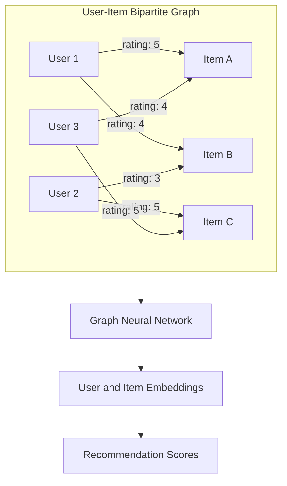
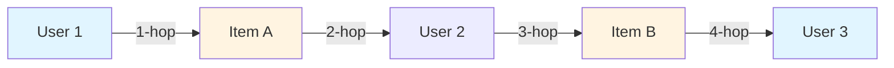
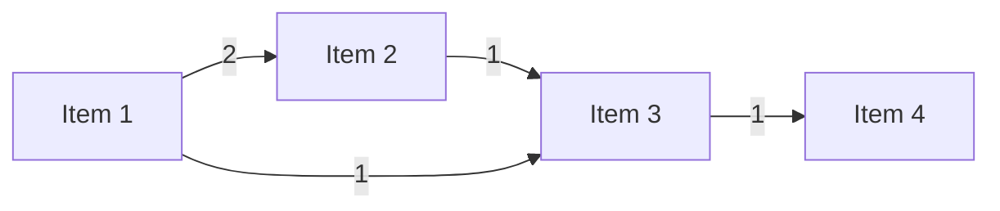
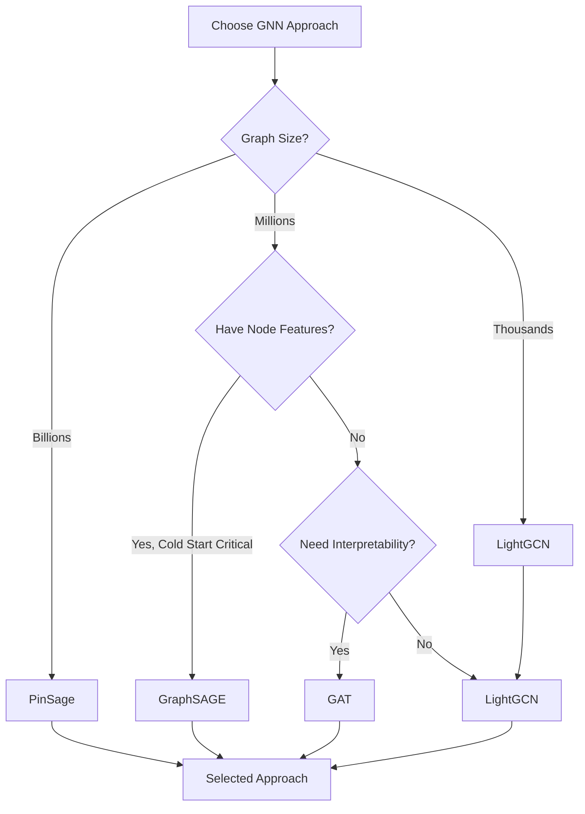

# Graph Neural Networks for Recommender Systems

This directory contains a comprehensive guide to Graph Neural Network (GNN) based approaches for recommender systems. GNNs model user-item interactions as graphs, enabling message passing to learn rich embeddings that capture high-order connectivity and collaborative signals.

## Table of Contents

1. [Introduction & Problem Formulation](#1-introduction--problem-formulation)
2. [Theoretical Foundations](#2-theoretical-foundations)
3. [GNN Approaches](#3-gnn-approaches)
   - [3.1 LightGCN](#31-lightgcn)
   - [3.2 NGCF](#32-ngcf)
   - [3.3 PinSage](#33-pinsage)
   - [3.4 GraphSAGE for Recommendations](#34-graphsage-for-recommendations)
   - [3.5 Graph Attention Networks (GAT)](#35-graph-attention-networks-gat)
   - [3.6 Session-Based GNN Approaches](#36-session-based-gnn-approaches)
4. [Practical Implementation Guide](#4-practical-implementation-guide)
5. [Comparison & Selection Guide](#5-comparison--selection-guide)
6. [Code Examples & Libraries](#6-code-examples--libraries)
7. [Evaluation & Metrics](#7-evaluation--metrics)
8. [Advanced Topics](#8-advanced-topics)
9. [References](#9-references)

---

## 1. Introduction & Problem Formulation

### Graph Representation of Recommendation Problem

Recommender systems can be naturally formulated as a graph problem. The fundamental insight is that user-item interactions form a bipartite graph where edges represent interactions (ratings, clicks, purchases, etc.).

#### Mathematical Formulation

A recommendation graph is defined as:

$$G = (V, E)$$

where:
- $V = U \cup I$ is the set of vertices (nodes)
  - $U = \{u_1, u_2, ..., u_m\}$: set of $m$ users
  - $I = \{i_1, i_2, ..., i_n\}$: set of $n$ items
- $E \subseteq U \times I$: set of edges representing interactions
  - Each edge $(u, i) \in E$ indicates user $u$ interacted with item $i$
  - Edge weights $w_{ui}$ can represent interaction strength (rating, frequency, etc.)

#### Bipartite Graph Structure



#### Edge Types and Weights

**Explicit Feedback**:
- Direct ratings (1-5 stars, thumbs up/down)
- Edge weight: $w_{ui} = r_{ui}$ (rating value)
- Sparse but high-quality signal

**Implicit Feedback**:
- Clicks, views, purchases, watch time
- Edge weight: $w_{ui} = f(\text{interaction\_count}, \text{duration}, ...)$
- Dense but noisy signal
- Common: binary (1 if interaction exists, 0 otherwise)

#### Graph Properties

**Sparsity**: 
- Typical recommendation graphs are extremely sparse
- Sparsity: $\rho = \frac{|E|}{|U| \times |I|} \ll 1$
- Example: MovieLens 100K has ~100K ratings for 943 users × 1682 items → sparsity ~6.3%

**Degree Distribution**:
- Power-law distribution (long-tail)
- Few popular items with many interactions
- Many items with few interactions
- Users also follow similar distribution

**Bipartite Property**:
- No edges between users or between items
- All paths between users go through items (and vice versa)
- Path length 2: user → item → user (collaborative filtering)

### Why Graphs for Recommendations?

#### 1. High-Order Connectivity Modeling

Traditional collaborative filtering only considers direct neighbors (1-hop). GNNs can capture multi-hop relationships:

- **1-hop**: Users who interacted with the same item
- **2-hop**: Users who interacted with items that share common users
- **K-hop**: Complex collaborative patterns



**Example**: If User 1 liked Item A, and User 2 (who is similar to User 1) liked both Item A and Item B, then Item B might be a good recommendation for User 1, even if User 1 never directly interacted with Item B.

#### 2. Collaborative Signal Propagation

GNNs explicitly model how collaborative signals propagate through the graph:
- Messages flow from items to users and vice versa
- Each layer aggregates information from neighbors
- Multiple layers capture signals at different distances

#### 3. Inductive Learning Capabilities

Unlike matrix factorization which requires retraining for new users/items, some GNN approaches (e.g., GraphSAGE) can:
- Generalize to unseen nodes
- Handle new users/items without full retraining
- Leverage node features for cold start

#### 4. Natural Representation of Relationships

Graphs naturally represent:
- Social networks (user-user connections)
- Knowledge graphs (item-item relationships)
- Heterogeneous information (multiple node/edge types)
- Temporal dynamics (time-stamped edges)

---

## 2. Theoretical Foundations

### Graph Neural Networks Primer

Graph Neural Networks extend neural networks to operate on graph-structured data. The core idea is to learn node representations by aggregating information from neighboring nodes.

#### Message Passing Framework

The fundamental operation in GNNs is **message passing**, which consists of three steps:

1. **Message Construction**: Each node creates messages to send to neighbors
2. **Message Aggregation**: Each node aggregates messages from neighbors
3. **Node Update**: Each node updates its representation based on aggregated messages

**General Formulation**:

For node $v$ at layer $k$:

**Message Construction**:
$$m_{u \rightarrow v}^{(k)} = \text{MSG}^{(k)}(e_u^{(k)}, e_v^{(k)}, w_{uv})$$

**Message Aggregation**:
$$M_v^{(k)} = \text{AGG}^{(k)}(\{m_{u \rightarrow v}^{(k)} : u \in \mathcal{N}(v)\})$$

**Node Update**:
$$e_v^{(k+1)} = \text{UPD}^{(k)}(e_v^{(k)}, M_v^{(k)})$$

where:
- $e_v^{(k)}$: embedding of node $v$ at layer $k$
- $\mathcal{N}(v)$: neighborhood of node $v$
- $w_{uv}$: edge weight between $u$ and $v$

#### Neighborhood Aggregation

The aggregation function determines how information from neighbors is combined:

**Common Aggregation Functions**:

1. **Mean Aggregation**:
   $$M_v = \frac{1}{|\mathcal{N}(v)|} \sum_{u \in \mathcal{N}(v)} e_u$$

2. **Sum Aggregation**:
   $$M_v = \sum_{u \in \mathcal{N}(v)} e_u$$

3. **Max Aggregation**:
   $$M_v = \max_{u \in \mathcal{N}(v)} e_u$$

4. **Weighted Aggregation** (with normalization):
   $$M_v = \sum_{u \in \mathcal{N}(v)} \frac{w_{uv}}{\sqrt{d_u d_v}} e_u$$
   where $d_u$ is the degree of node $u$

#### Graph Convolution Operations

Graph Convolutional Networks (GCNs) perform convolution-like operations on graphs:

**Spectral Convolution** (theoretical foundation):
- Based on graph Fourier transform
- Uses graph Laplacian eigenvalues/eigenvectors
- Computationally expensive for large graphs

**Spatial Convolution** (practical approach):
- Directly aggregates neighbor features
- More efficient and scalable
- Most modern GNNs use this approach

**Basic GCN Layer**:
$$e_v^{(k+1)} = \sigma\left(W^{(k)} \cdot \text{AGG}(\{e_u^{(k)} : u \in \mathcal{N}(v) \cup \{v\}\})\right)$$

where $\sigma$ is a non-linear activation function (ReLU, LeakyReLU, etc.).

#### Layer Stacking and Depth Considerations

**Multi-Layer GNNs**:
- Stack multiple GCN layers
- Each layer aggregates information from $k$-hop neighbors
- Layer $k$ captures $k$-hop connectivity

**Depth Trade-offs**:
- **Shallow (1-2 layers)**: Focuses on immediate neighbors, less over-smoothing
- **Deep (3+ layers)**: Captures long-range dependencies, but risk of over-smoothing
- **Over-smoothing**: All nodes converge to similar embeddings with too many layers

**Typical Depth for Recommendations**:
- LightGCN: 2-3 layers optimal
- NGCF: 2-3 layers
- PinSage: 2 layers (with sampling)

### Key Concepts

#### Embedding Propagation

Embedding propagation is the process of updating node embeddings by incorporating information from neighbors:

**Propagation Rule**:
$$e_v^{(k+1)} = f(e_v^{(k)}, \{e_u^{(k)} : u \in \mathcal{N}(v)\})$$

The function $f$ can be:
- Linear combination (LightGCN)
- Non-linear transformation (NGCF)
- Attention-weighted (GAT)

#### Normalization Strategies

Normalization is crucial for stable training and preventing exploding gradients.

**Symmetric Normalization** (LightGCN, GCN):
$$\tilde{A} = D^{-1/2} A D^{-1/2}$$

where:
- $A$: adjacency matrix
- $D$: degree matrix ($D_{ii} = \sum_j A_{ij}$)

**Row Normalization**:
$$\tilde{A} = D^{-1} A$$

**Why Normalization?**:
- Prevents embeddings from growing unbounded
- Balances influence of high-degree vs. low-degree nodes
- Improves numerical stability

#### Over-Smoothing Problem

**Definition**: As the number of layers increases, node embeddings become increasingly similar, losing discriminative power.

**Cause**: Repeated aggregation averages out node-specific information.

**Solutions**:
- Limit depth (2-3 layers)
- Residual connections
- Layer-wise normalization
- Attention mechanisms (GAT)

#### Graph Structure vs. Feature Learning

**Structure-Based Learning**:
- Relies primarily on graph topology
- Embeddings learned from connectivity patterns
- Examples: LightGCN, NGCF

**Feature-Based Learning**:
- Incorporates node features (user demographics, item metadata)
- Combines structure and features
- Examples: GraphSAGE, GAT with features

**Hybrid Approaches**:
- Use both structure and features
- More expressive but requires feature engineering

---

## 3. GNN Approaches

### 3.1 LightGCN

**LightGCN: Simplifying and Powering Graph Convolution Network for Recommendation** (SIGIR 2020)

LightGCN is a simplified version of Graph Convolutional Networks specifically designed for collaborative filtering. It removes unnecessary complexity (feature transformations, non-linear activations) that was found to hurt recommendation performance.

#### Theoretical Foundation

**Key Insight**: In collaborative filtering, feature transformations and non-linear activations are not only unnecessary but actually harmful. The graph structure itself provides sufficient signal.

**Simplification Principle**:
- Remove feature transformation matrices
- Remove non-linear activation functions
- Keep only neighborhood aggregation and layer combination

#### Layer-wise Propagation

For user $u$ and item $i$ at layer $k+1$:

**User Embedding Update**:
$$e_u^{(k+1)} = \sum_{i \in \mathcal{N}_u} \frac{1}{\sqrt{|\mathcal{N}_u||\mathcal{N}_i|}} e_i^{(k)}$$

**Item Embedding Update**:
$$e_i^{(k+1)} = \sum_{u \in \mathcal{N}_i} \frac{1}{\sqrt{|\mathcal{N}_i||\mathcal{N}_u|}} e_u^{(k)}$$

where:
- $\mathcal{N}_u$: set of items interacted by user $u$
- $\mathcal{N}_i$: set of users who interacted with item $i$
- The normalization factor $\frac{1}{\sqrt{|\mathcal{N}_u||\mathcal{N}_i|}}$ is symmetric normalization

**Intuition**: Each layer aggregates embeddings from neighbors, with symmetric normalization to balance the influence of high-degree and low-degree nodes.

#### Layer Combination

Instead of using only the final layer, LightGCN combines embeddings from all layers:

$$e_u = \sum_{k=0}^K \alpha_k e_u^{(k)}, \quad e_i = \sum_{k=0}^K \alpha_k e_i^{(k)}$$

**Typical Weighting**:
- Uniform: $\alpha_k = \frac{1}{K+1}$ for all $k$
- Learnable: $\alpha_k$ learned during training
- Empirical: Often uniform works well

**Why Layer Combination?**:
- Different layers capture different hop distances
- Layer 0: Initial embeddings (self-information)
- Layer 1: Direct neighbors (1-hop)
- Layer 2: Neighbors of neighbors (2-hop)
- Combining preserves information at all levels

#### Matrix Form (Efficient Computation)

For efficient computation, the propagation can be written in matrix form:

**Adjacency Matrix Construction**:
$$A = \begin{bmatrix}
0 & R \\
R^T & 0
\end{bmatrix}$$

where $R \in \mathbb{R}^{m \times n}$ is the user-item interaction matrix.

**Normalized Adjacency Matrix**:
$$\tilde{A} = D^{-1/2} A D^{-1/2}$$

where $D$ is the degree matrix.

**Matrix Propagation**:
$$E^{(k+1)} = \tilde{A} E^{(k)}$$

where $E^{(k)} \in \mathbb{R}^{(m+n) \times d}$ contains embeddings for all users and items.

**Final Embedding**:
$$E = \sum_{k=0}^K \alpha_k E^{(k)}$$

#### Prediction

Prediction score for user $u$ and item $i$:

$$\hat{y}_{ui} = e_u^T e_i$$

Simple dot product of final embeddings.

#### Loss Function

**Bayesian Personalized Ranking (BPR) Loss**:

$$\mathcal{L} = -\sum_{(u,i,j) \in \mathcal{O}} \ln \sigma(\hat{y}_{ui} - \hat{y}_{uj}) + \lambda\|E^{(0)}\|^2$$

where:
- $(u,i,j)$: triplet where user $u$ interacted with item $i$ (positive) but not item $j$ (negative)
- $\sigma$: sigmoid function
- $\lambda$: regularization parameter
- $\|E^{(0)}\|^2$: L2 regularization on initial embeddings

**Negative Sampling**: For each positive pair $(u,i)$, sample a negative item $j$ that user $u$ hasn't interacted with.

#### Why It Works

1. **Symmetric Normalization**: Prevents scale issues and balances node influence
2. **Multiple Layers**: Captures collaborative signal propagation at different distances
3. **Simple Design**: Easy to implement, debug, and scale
4. **No Over-Engineering**: Removes components that don't help in CF setting

#### Implementation Considerations

**Efficient Sparse Matrix Operations**:
- Use sparse matrix formats (CSR, COO)
- Leverage optimized libraries (scipy.sparse, PyTorch Sparse)
- Batch operations when possible

**Layer Depth Selection**:
- Start with 2-3 layers
- Too few: misses long-range signals
- Too many: over-smoothing
- Validate on held-out data

**Embedding Initialization**:
- Xavier/Glorot initialization common
- Small random values (e.g., $\mathcal{N}(0, 0.01)$)
- Can use pre-trained embeddings from MF

**BPR Loss Implementation**:
- Efficient negative sampling (uniform or popularity-based)
- Batch construction: sample multiple triplets per user
- Consider hard negative mining for better performance

**Libraries**:
- **PyTorch Geometric**: Built-in GCN layers, easy to customize
- **Deep Graph Library (DGL)**: Efficient message passing, good for large graphs
- **Custom Implementation**: Full control, can optimize for specific use case

**Hyperparameters**:
- Embedding dimension: 64-256 (typically 64 or 128)
- Learning rate: 0.001-0.01
- Regularization $\lambda$: 0.0001-0.001
- Number of layers $K$: 2-3
- Layer weights $\alpha_k$: uniform or learnable

---

### 3.2 NGCF

**NGCF: Neural Graph Collaborative Filtering** (SIGIR 2019)

NGCF explicitly models high-order connectivity through embedding propagation with feature interaction terms. Unlike LightGCN, it includes non-linear transformations and explicit user-item interaction modeling.

#### Theoretical Foundation

**Key Innovation**: Explicit modeling of user-item interactions through feature interaction terms in message passing.

**Message Construction**:

For message from item $i$ to user $u$:

$$m_{u \leftarrow i} = \frac{1}{\sqrt{|\mathcal{N}_u||\mathcal{N}_i|}}(W_1 e_i + W_2(e_i \odot e_u))$$

where:
- $W_1, W_2 \in \mathbb{R}^{d \times d}$: learnable weight matrices
- $\odot$: element-wise product (Hadamard product)
- First term: item embedding transformation
- Second term: explicit user-item interaction

**Intuition**: The interaction term $e_i \odot e_u$ captures how well item $i$ matches user $u$'s preferences.

#### Message Aggregation

**User Embedding Update**:

$$e_u^{(k)} = \text{LeakyReLU}\left(m_{u \leftarrow u} + \sum_{i \in \mathcal{N}_u} m_{u \leftarrow i}\right)$$

where:
- $m_{u \leftarrow u} = W_1 e_u^{(k-1)}$: self-connection
- LeakyReLU: non-linear activation (slope 0.2 typical)

**Item Embedding Update** (symmetric):

$$e_i^{(k)} = \text{LeakyReLU}\left(m_{i \leftarrow i} + \sum_{u \in \mathcal{N}_i} m_{i \leftarrow u}\right)$$

#### Feature Interaction

The element-wise product $e_i \odot e_u$ explicitly models:
- Which item features align with user preferences
- Interaction strength between user and item characteristics
- More expressive than simple dot product

**Example**: If $e_u[0]$ (user's preference for action) and $e_i[0]$ (item's action score) are both high, their product is high, indicating a good match.

#### Final Representation

NGCF concatenates embeddings from all layers:

$$e_u^* = e_u^{(0)} \| e_u^{(1)} \| ... \| e_u^{(K)}$$

where $\|$ denotes concatenation.

**Embedding Dimension**: If each layer has dimension $d$, final embedding has dimension $(K+1) \times d$.

**Prediction**: 
$$\hat{y}_{ui} = e_u^{*T} e_i^*$$

#### Comparison with LightGCN

| Aspect | NGCF | LightGCN |
|--------|------|----------|
| **Feature Transformation** | Yes ($W_1, W_2$) | No |
| **Non-linearity** | LeakyReLU | None |
| **Interaction Modeling** | Explicit ($e_i \odot e_u$) | Implicit (via aggregation) |
| **Final Representation** | Concatenation | Weighted sum |
| **Complexity** | Higher | Lower |
| **Parameters** | More | Fewer |
| **Performance** | Similar or slightly worse | Often better |

**When to Use NGCF**:
- Need explicit interaction modeling
- Have rich node features to combine
- Want more interpretable interactions

**When to Use LightGCN**:
- Simplicity and efficiency priority
- Pure collaborative filtering (no features)
- Large-scale deployment

#### Implementation Considerations

**Weight Matrices Initialization**:
- $W_1, W_2$: Xavier/Glorot initialization
- Can initialize $W_2$ smaller to start with weaker interactions
- Consider identity initialization for $W_1$

**Message Passing Complexity**:
- More expensive than LightGCN (matrix multiplications)
- Memory: stores $W_1, W_2$ for each layer
- Computation: $O(d^2)$ per message vs. $O(d)$ for LightGCN

**Memory Requirements**:
- Higher than LightGCN due to:
  - Weight matrices per layer
  - Concatenated final embeddings
  - Intermediate activations

**When to Use NGCF vs. LightGCN**:
- **NGCF**: When you need explicit interaction modeling or have features
- **LightGCN**: For pure CF, simplicity, and efficiency

---

### 3.3 PinSage

**PinSage: Graph Convolutional Neural Networks for Web-Scale Recommender Systems** (KDD 2018)

PinSage is an industrial-scale GNN system developed at Pinterest. It addresses the challenge of applying GNNs to billion-node graphs that don't fit in memory.

#### Theoretical Foundation

**Challenge**: Billion-node graphs don't fit in memory. Standard GCN approaches require loading the entire graph.

**Solution**: Node-wise sampling with random walks and importance pooling.

#### Random Walk-Based Sampling

Instead of using all neighbors, PinSage samples a neighborhood using random walks:

**Random Walk Process**:
1. Start from target node $v$
2. Perform random walk of length $L$
3. Sample top-$T$ nodes by visit frequency
4. These form the neighborhood $\mathcal{N}(v)$

**Benefits**:
- Fixed-size neighborhoods (memory efficient)
- Importance-based sampling (frequent nodes more likely)
- Captures local graph structure

#### Importance Pooling

Instead of simple mean pooling, PinSage uses importance-based pooling:

**Importance Weights**:
$$p(u, v) = \frac{\text{visit\_count}(u)}{\text{total\_visits}}$$

**Pooling**:
$$z_{\mathcal{N}(v)} = \gamma \cdot \text{POOL}(\{p(u,v) \cdot z_u : u \in \mathcal{N}(v)\})$$

where $\gamma$ is a normalization constant.

**Intuition**: Nodes visited more frequently in random walks are more important and weighted higher.

#### Node Update

$$z_v = \sigma(W \cdot \text{CONCAT}(z_v^{(k-1)}, z_{\mathcal{N}(v)}^{(k-1)}))$$

where:
- $W$: learnable weight matrix
- CONCAT: concatenation of self and neighborhood
- $\sigma$: ReLU activation

#### Efficient Training

**Producer-Consumer Architecture**:
- **Producer (CPU)**: Samples neighborhoods, constructs mini-batches
- **Consumer (GPU)**: Trains model on mini-batches
- Parallelizes I/O and computation

**Hard Negative Sampling**:
- Instead of random negatives, sample items close in embedding space
- More challenging negatives → better learning
- Improves recommendation quality

#### MapReduce Inference

**Offline Pre-computation**:
1. Compute embeddings for all nodes using MapReduce
2. Store embeddings in distributed storage
3. Build approximate nearest neighbor index (e.g., FAISS)

**Online Serving**:
1. Lookup user embedding (pre-computed)
2. Query ANN index for similar items
3. Return top-K recommendations

**Benefits**:
- Fast inference (milliseconds)
- Scalable to billions of items
- No need to run GNN at inference time

#### Impact

- Powers "Related Pins" at Pinterest
- 150M+ user actions weekly
- Billions of recommendations daily
- Handles graphs with billions of nodes

#### Implementation Considerations

**Distributed Training Setup**:
- Requires distributed computing infrastructure
- Graph partitioning for parallel processing
- Synchronization of model parameters

**MapReduce Inference Pipeline**:
- Batch processing for embedding computation
- Distributed storage (HDFS, S3)
- ANN index construction (FAISS, HNSW)

**Node Sampling Implementation**:
- Efficient random walk algorithms
- Caching of sampled neighborhoods
- Balancing exploration vs. exploitation

**Scaling to Billion-Node Graphs**:
- Graph sharding/partitioning
- Distributed message passing
- Incremental updates for new nodes

**When to Use PinSage**:
- Industrial-scale applications (billions of nodes)
- Have distributed infrastructure
- Can invest in complex implementation
- Need offline inference pipeline

**When NOT to Use PinSage**:
- Small to medium-scale graphs (< 100M nodes)
- Real-time inference requirements
- Limited infrastructure
- Prefer simpler solutions (LightGCN)

---

### 3.4 GraphSAGE for Recommendations

**GraphSAGE: Inductive Representation Learning on Large Graphs** (NeurIPS 2017)

GraphSAGE (Graph Sample and Aggregate) is designed for inductive learning, making it particularly useful for cold start scenarios in recommendations.

#### Theoretical Foundation

**Key Innovation**: Inductive learning - can generate embeddings for nodes not seen during training.

**Neighborhood Sampling**:
- Instead of using all neighbors, sample fixed-size neighborhood
- Sample $S$ neighbors at each layer
- Reduces computation and enables inductive learning

**Aggregator Functions**:

1. **Mean Aggregator**:
   $$h_{\mathcal{N}(v)} = \text{MEAN}(\{h_u : u \in \mathcal{N}(v)\})$$

2. **LSTM Aggregator**:
   - Treats neighbors as sequence
   - More expressive but less permutation-invariant

3. **Pooling Aggregator**:
   $$h_{\mathcal{N}(v)} = \text{MAX}(\{\sigma(W_{pool} h_u + b) : u \in \mathcal{N}(v)\})$$
   - Element-wise max pooling
   - More expressive than mean

**Node Update**:
$$h_v^{(k)} = \sigma(W^{(k)} \cdot \text{CONCAT}(h_v^{(k-1)}, h_{\mathcal{N}(v)}^{(k-1)}))$$

#### Inductive Learning Capability

**Transductive vs. Inductive**:
- **Transductive** (LightGCN, NGCF): Requires all nodes at training time
- **Inductive** (GraphSAGE): Can handle new nodes at inference

**For Recommendations**:
- New users/items can get embeddings without retraining
- Use node features (demographics, metadata) for initialization
- Sample neighborhood from existing graph

#### Implementation Considerations

**Sampling Size Selection**:
- Typical: $S_1 = 25, S_2 = 10$ (2 layers)
- Larger $S$: more information but slower
- Smaller $S$: faster but may miss important neighbors

**Aggregator Choice for RecSys**:
- **Mean**: Simple, fast, works well
- **Pooling**: More expressive, slightly slower
- **LSTM**: Most expressive but slowest, less common

**Cold Start Advantages**:
- Can generate embeddings for new users/items immediately
- Use features to initialize embeddings
- Sample from existing graph structure

**When to Use GraphSAGE**:
- Cold start is critical
- Have rich node features
- Need inductive learning
- Graph changes frequently (new nodes added)

---

### 4.2 Graph Attention Networks (GAT) for RecSys

**Graph Attention Networks** (ICLR 2018)

GAT introduces attention mechanisms to graphs, allowing nodes to attend to different neighbors with different weights.

#### Theoretical Foundation

**Attention Mechanism**:
- Each node learns to weight its neighbors differently
- Attention weights are learned, not fixed
- More expressive than uniform or degree-based weighting

**Attention Computation**:

For node $v$ attending to neighbor $u$:

$$e_{vu} = \text{LeakyReLU}(a^T [W h_v \| W h_u])$$

$$\alpha_{vu} = \frac{\exp(e_{vu})}{\sum_{w \in \mathcal{N}(v)} \exp(e_{vw})}$$

where:
- $a$: learnable attention vector
- $W$: learnable weight matrix
- $\|$: concatenation

**Attended Aggregation**:
$$h_v^{(k)} = \sigma\left(\sum_{u \in \mathcal{N}(v)} \alpha_{vu} W h_u^{(k-1)}\right)$$

#### Multi-Head Attention

To stabilize learning and capture different aspects:

$$h_v^{(k)} = \|_{\ell=1}^L \sigma\left(\sum_{u \in \mathcal{N}(v)} \alpha_{vu}^{(\ell)} W^{(\ell)} h_u^{(k-1)}\right)$$

where $L$ is the number of attention heads.

**Final Representation** (for prediction):
$$h_v = \frac{1}{L} \sum_{\ell=1}^L h_v^{(\ell)}$$

or concatenation followed by linear transformation.

#### Attention Weights Interpretation

**Interpretability Benefit**:
- Attention weights $\alpha_{vu}$ show which neighbors are important
- Can explain recommendations: "Recommended because you interacted with similar items"
- Useful for debugging and understanding model behavior

#### Implementation Considerations

**Attention Computation Overhead**:
- More expensive than LightGCN (attention computation)
- $O(|\mathcal{N}(v)|^2)$ per node for attention
- Can be optimized with sparse attention

**Interpretability Benefits**:
- Attention weights provide explanations
- Visualize which items/users influenced recommendation
- Better user trust and understanding

**When Attention Helps in Recommendations**:
- Heterogeneous user preferences (some neighbors more important)
- Items with varying relevance
- Need for explainable recommendations
- Complex interaction patterns

**When NOT to Use GAT**:
- Simple, uniform relationships sufficient
- Computational budget limited
- Large neighborhoods (attention too expensive)

---

### 3.6 Session-Based GNN Approaches

#### SR-GNN: Session-based Recommendation with Graph Neural Networks

**Problem**: Session-based recommendations where we only have current session data, no long-term user history.

**Session Graph Construction**:
- Each session is a sequence: $S = [i_1, i_2, ..., i_t]$
- Construct directed graph: items are nodes, edges represent transitions
- Edge weight: frequency of transition

**Graph Structure**:


**GNN Processing**:
1. Apply GNN to session graph
2. Get item embeddings
3. Aggregate to session embedding
4. Predict next item

**Temporal Modeling**:
- Can incorporate time information in edges
- Weight recent interactions higher
- Model session evolution

**Implementation for Session Data**:
- Build graph per session
- Batch process multiple sessions
- Efficient for real-time recommendations

---

## 4. Practical Implementation Guide

### 4.1 Data Preparation

#### Graph Construction

**Building Adjacency Matrices**:

For user-item bipartite graph:

```python
# Interaction matrix R: shape (num_users, num_items)
# R[u, i] = 1 if user u interacted with item i, else 0

# Construct bipartite adjacency matrix
import numpy as np
from scipy.sparse import csr_matrix

# User-item interactions
num_users, num_items = R.shape

# Bipartite adjacency: [0 R; R^T 0]
A_top = csr_matrix((num_users, num_items))
A_bottom = R.T
A = scipy.sparse.vstack([
    scipy.sparse.hstack([A_top, R]),
    scipy.sparse.hstack([A_bottom, A_top.T])
])
```

**Handling Implicit vs. Explicit Feedback**:

**Implicit Feedback** (binary):
- Edge exists if interaction occurred
- Weight = 1 (or interaction frequency)

**Explicit Feedback** (ratings):
- Edge weight = rating value (normalized)
- Can threshold: weight = 1 if rating >= threshold

**Edge Weight Normalization**:
- Normalize by user/item degree
- Normalize by max rating
- Use confidence weighting (more interactions = higher confidence)

#### Graph Preprocessing

**Self-Loops**:
- Add self-loops: $A' = A + I$
- Helps preserve node's own information
- Some methods (LightGCN) don't need them

**Normalization**:
- Symmetric: $\tilde{A} = D^{-1/2} A D^{-1/2}$
- Row: $\tilde{A} = D^{-1} A$
- Pre-compute for efficiency

**Sparsity Handling**:
- Use sparse matrix formats (CSR, COO)
- Only store non-zero edges
- Efficient for large, sparse graphs

### 4.2 Model Architecture

#### Layer Design

**Number of Layers (Depth)**:
- **1 layer**: Immediate neighbors only
- **2 layers**: 2-hop neighbors (typical)
- **3 layers**: 3-hop neighbors (max before over-smoothing)
- **4+ layers**: Usually over-smoothing

**Empirical Guidelines**:
- Start with 2 layers
- Try 3 if dataset is large and sparse
- Monitor embedding similarity (over-smoothing indicator)

**Embedding Dimensions**:
- Common: 64, 128, 256
- Larger: more expressive but slower
- Smaller: faster but less capacity
- Start with 64 or 128

**Normalization Strategies**:
- **Layer Normalization**: Normalize within layer
- **Batch Normalization**: Normalize across batch
- **Embedding Normalization**: L2 normalize embeddings
- Often not needed for LightGCN (simple design)

**Dropout Considerations**:
- Dropout on embeddings: prevent overfitting
- Typical rate: 0.1-0.3
- Not always needed (LightGCN often works without)

### 4.3 Training

#### Loss Functions

**BPR (Bayesian Personalized Ranking)**:
- Most common for implicit feedback
- Maximizes difference between positive and negative pairs
- Implementation:
```python
def bpr_loss(pos_scores, neg_scores):
    return -torch.mean(torch.log(torch.sigmoid(pos_scores - neg_scores)))
```

**Contrastive Losses**:
- InfoNCE loss
- Triplet loss
- Alternative to BPR

**Multi-Task Learning**:
- Combine BPR with auxiliary tasks
- Rating prediction + ranking
- Can improve performance

#### Optimization

**Learning Rate Schedules**:
- Start: 0.001-0.01
- Decay: Reduce by factor of 0.5-0.9 every N epochs
- Warm-up: Gradually increase for first few epochs

**Regularization Techniques**:
- L2 regularization on embeddings
- Dropout
- Early stopping
- Weight decay

**Negative Sampling Strategies**:
- **Uniform**: Random negative items
- **Popularity-based**: Sample proportional to popularity
- **Hard negatives**: Items close in embedding space
- Typical ratio: 1 positive : 1-4 negatives

**Batch Construction for Graphs**:
- Sample user-item pairs
- For each positive pair, sample negatives
- Batch size: 512-2048 (depending on memory)
- Can use graph-specific batching (subgraph sampling)

### 4.4 Inference & Serving

#### Online vs. Offline

**Offline (Pre-compute)**:
- Compute all user/item embeddings
- Store in database/cache
- Fast lookup at serving time
- Used by: PinSage, large-scale systems

**Online (Real-time)**:
- Compute embeddings on-demand
- Incorporate latest interactions
- More flexible but slower
- Used by: Small-scale, real-time systems

**Hybrid Approach**:
- Pre-compute base embeddings
- Update online for recent interactions
- Best of both worlds

#### Real-time Inference Strategies

**Incremental Updates**:
- Update embeddings for affected nodes only
- Efficient for small changes
- Approximate but fast

**Caching**:
- Cache popular user embeddings
- Cache item embeddings (rarely change)
- Reduce computation

#### Approximate Nearest Neighbor Search

**FAISS**:
- Facebook AI Similarity Search
- Efficient similarity search
- Supports GPU acceleration
- Billions of vectors

**HNSW** (Hierarchical Navigable Small World):
- Graph-based ANN
- Excellent accuracy-speed tradeoff
- Used in many production systems

**Usage**:
```python
import faiss

# Build index
index = faiss.IndexFlatL2(embedding_dim)
index.add(item_embeddings)

# Search
distances, indices = index.search(user_embedding, k=10)
```

#### Caching Strategies

**User Profile Cache**:
- Cache recent user embeddings
- TTL: 1 hour - 1 day
- Invalidate on new interactions

**Item Embeddings Cache**:
- Items change rarely
- Cache aggressively
- Update periodically (daily/weekly)

**Recommendation Cache**:
- Cache top-K for popular users
- Reduce computation
- Balance freshness vs. efficiency

### 4.5 Scalability Techniques

#### Sampling Methods

**Node Sampling**:
- Sample subset of neighbors
- Fixed size: $S$ neighbors per node
- Used by: GraphSAGE, PinSage

**Layer-wise Sampling**:
- Different sample size per layer
- $S_1 > S_2 > ... > S_K$
- Reduces computation exponentially

**Random Walk Sampling**:
- Sample via random walks
- Importance-based
- Used by: PinSage

#### Distributed Training

**Graph Partitioning**:
- Partition graph across machines
- Minimize cross-partition edges
- Balance partition sizes

**Distributed Message Passing**:
- Each machine handles its partition
- Communicate boundary nodes
- Synchronize embeddings

**Synchronization Strategies**:
- **Synchronous**: Wait for all, then update (slower but stable)
- **Asynchronous**: Update immediately (faster but may diverge)
- **Stale synchronous**: Allow some staleness (middle ground)

---

## 5. Comparison & Selection Guide

### When to Use Each Approach

#### LightGCN
**Best For**:
- General-purpose collaborative filtering
- Simplicity and efficiency priority
- Large-scale deployment
- Pure interaction data (no features)

**Strengths**:
- Simple to implement and understand
- Fast training and inference
- Excellent performance
- Good scalability

**Limitations**:
- No explicit feature support
- Transductive (needs all nodes at training)
- Limited interpretability

#### NGCF
**Best For**:
- Rich interaction modeling needed
- Want explicit user-item interactions
- Have node features to incorporate
- Need more expressive model

**Strengths**:
- Explicit interaction modeling
- More expressive than LightGCN
- Can incorporate features

**Limitations**:
- More complex and slower
- More parameters
- Often similar or worse performance than LightGCN

#### PinSage
**Best For**:
- Billion-scale graphs
- Industrial applications
- Have distributed infrastructure
- Can invest in complex implementation

**Strengths**:
- Handles billion-node graphs
- Proven at scale (Pinterest)
- Efficient inference (pre-computed)

**Limitations**:
- Complex implementation
- Requires distributed infrastructure
- Overkill for smaller graphs

#### GraphSAGE
**Best For**:
- Cold start critical
- Have rich node features
- Graph changes frequently
- Need inductive learning

**Strengths**:
- Inductive learning
- Handles new nodes
- Good for cold start

**Limitations**:
- Requires node features
- Sampling can miss important neighbors
- More complex than LightGCN

#### GAT (Graph Attention Networks)
**Best For**:
- Interpretability important
- Heterogeneous relationships
- Need attention-based explanations
- Complex interaction patterns

**Strengths**:
- Interpretable (attention weights)
- Adaptive neighbor weighting
- Handles heterogeneous relationships

**Limitations**:
- Computationally expensive
- Attention overhead
- May not outperform simpler methods

#### Session-Based GNN (SR-GNN)
**Best For**:
- Session-based recommendations
- No long-term user history available
- E-commerce, news, music streaming
- Real-time next-item prediction

**Strengths**:
- Handles anonymous users
- Captures session-level patterns
- Good for real-time recommendations
- No cold start for sessions

**Limitations**:
- Limited to session context
- Doesn't leverage long-term preferences
- May miss cross-session patterns
- Requires session data structure

### Performance Trade-offs

| Approach | Accuracy | Training Time | Inference Speed | Memory | Complexity | Scalability |
|----------|----------|---------------|-----------------|--------|------------|------------|
| **LightGCN** | ⭐⭐⭐⭐⭐ | ⭐⭐⭐⭐ | ⭐⭐⭐⭐⭐ | ⭐⭐⭐⭐ | ⭐⭐⭐⭐⭐ | ⭐⭐⭐⭐⭐ |
| **NGCF** | ⭐⭐⭐⭐ | ⭐⭐⭐ | ⭐⭐⭐⭐ | ⭐⭐⭐ | ⭐⭐⭐ | ⭐⭐⭐⭐ |
| **PinSage** | ⭐⭐⭐⭐⭐ | ⭐⭐ | ⭐⭐⭐⭐⭐ | ⭐⭐⭐ | ⭐⭐ | ⭐⭐⭐⭐⭐ |
| **GraphSAGE** | ⭐⭐⭐⭐ | ⭐⭐⭐ | ⭐⭐⭐⭐ | ⭐⭐⭐⭐ | ⭐⭐⭐ | ⭐⭐⭐⭐ |
| **GAT** | ⭐⭐⭐⭐ | ⭐⭐ | ⭐⭐⭐ | ⭐⭐⭐ | ⭐⭐ | ⭐⭐⭐ |
| **Session-Based GNN (SR-GNN)** | ⭐⭐⭐⭐ | ⭐⭐⭐ | ⭐⭐⭐⭐ | ⭐⭐⭐⭐ | ⭐⭐⭐ | ⭐⭐⭐⭐ |

**Scalability Limits**:
- **LightGCN**: Millions of nodes (single machine), billions (distributed)
- **NGCF**: Millions of nodes
- **PinSage**: Billions of nodes (distributed)
- **GraphSAGE**: Millions of nodes
- **GAT**: Hundreds of thousands to millions (attention expensive)
- **Session-Based GNN**: Millions of sessions (session graphs are small, scales well)

### Decision Framework



---

## 6. Code Examples & Libraries

### PyTorch Geometric

**LightGCN Implementation Example**:

```python
import torch
import torch.nn as nn
from torch_geometric.nn import MessagePassing
from torch_geometric.utils import add_self_loops, degree

class LightGCNLayer(MessagePassing):
    def __init__(self):
        super(LightGCNLayer, self).__init__(aggr='add')
    
    def forward(self, x, edge_index):
        # x: node embeddings [num_nodes, embedding_dim]
        # edge_index: graph connectivity [2, num_edges]
        
        # Add self-loops (optional for LightGCN)
        edge_index, _ = add_self_loops(edge_index, num_nodes=x.size(0))
        
        # Compute normalization
        row, col = edge_index
        deg = degree(col, x.size(0), dtype=x.dtype)
        deg_inv_sqrt = deg.pow(-0.5)
        deg_inv_sqrt[deg_inv_sqrt == float('inf')] = 0
        norm = deg_inv_sqrt[row] * deg_inv_sqrt[col]
        
        # Propagate
        return self.propagate(edge_index, x=x, norm=norm)
    
    def message(self, x_j, norm):
        return norm.view(-1, 1) * x_j

class LightGCN(nn.Module):
    def __init__(self, num_users, num_items, embedding_dim=64, num_layers=2):
        super(LightGCN, self).__init__()
        self.num_users = num_users
        self.num_items = num_items
        self.embedding_dim = embedding_dim
        self.num_layers = num_layers
        
        # Initial embeddings
        self.user_embedding = nn.Embedding(num_users, embedding_dim)
        self.item_embedding = nn.Embedding(num_items, embedding_dim)
        nn.init.normal_(self.user_embedding.weight, std=0.1)
        nn.init.normal_(self.item_embedding.weight, std=0.1)
        
        # GCN layers
        self.convs = nn.ModuleList([LightGCNLayer() for _ in range(num_layers)])
        
        # Layer weights (uniform by default)
        self.alpha = 1.0 / (num_layers + 1)
    
    def forward(self, edge_index):
        # Combine user and item embeddings
        x = torch.cat([self.user_embedding.weight, self.item_embedding.weight], dim=0)
        
        # Store embeddings from all layers
        embeddings = [x]
        
        # Propagate through layers
        for conv in self.convs:
            x = conv(x, edge_index)
            embeddings.append(x)
        
        # Layer combination (uniform weighting)
        final_embedding = sum(embeddings) * self.alpha
        
        # Split back to users and items
        user_emb, item_emb = torch.split(final_embedding, [self.num_users, self.num_items])
        
        return user_emb, item_emb
    
    def predict(self, user_ids, item_ids):
        user_emb, item_emb = self.forward(self.edge_index)
        user_emb = user_emb[user_ids]
        item_emb = item_emb[item_ids]
        return (user_emb * item_emb).sum(dim=1)
```

**Data Loading for Bipartite Graphs**:

```python
from torch_geometric.data import Data

def build_bipartite_graph(user_item_pairs, num_users, num_items):
    # user_item_pairs: list of (user_id, item_id) tuples
    
    # Create edge index
    user_ids = [u for u, _ in user_item_pairs]
    item_ids = [i + num_users for _, i in user_item_pairs]  # Offset item IDs
    
    edge_index = torch.tensor([user_ids, item_ids], dtype=torch.long)
    
    # Create graph data
    data = Data(edge_index=edge_index)
    data.num_users = num_users
    data.num_items = num_items
    
    return data
```

### Deep Graph Library (DGL)

**Graph Construction**:

```python
import dgl
import torch

def build_dgl_graph(user_item_pairs, num_users, num_items):
    # Create bipartite graph
    user_ids = torch.tensor([u for u, _ in user_item_pairs])
    item_ids = torch.tensor([i for _, i in user_item_pairs])
    
    # DGL bipartite graph
    graph = dgl.heterograph({
        ('user', 'interacts', 'item'): (user_ids, item_ids),
        ('item', 'interacted_by', 'user'): (item_ids, user_ids)
    })
    
    return graph
```

**Built-in GNN Layers**:

```python
import dgl.nn.pytorch as dglnn

class LightGCN_DGL(nn.Module):
    def __init__(self, num_users, num_items, embedding_dim=64, num_layers=2):
        super().__init__()
        self.user_embedding = nn.Embedding(num_users, embedding_dim)
        self.item_embedding = nn.Embedding(num_items, embedding_dim)
        
        # DGL GraphConv (simplified for LightGCN)
        self.convs = nn.ModuleList([
            dglnn.GraphConv(embedding_dim, embedding_dim, activation=None)
            for _ in range(num_layers)
        ])
    
    def forward(self, graph):
        # Get node features
        user_feat = self.user_embedding.weight
        item_feat = self.item_embedding.weight
        x = torch.cat([user_feat, item_feat], dim=0)
        
        embeddings = [x]
        for conv in self.convs:
            x = conv(graph, x)
            embeddings.append(x)
        
        # Layer combination
        final = sum(embeddings) / len(embeddings)
        return final
```

**PinSage Implementation Example**:

Based on the [DGL PinSage example](https://github.com/dmlc/dgl/blob/master/examples/pytorch/pinsage/model.py), here's a simplified implementation:

```python
import dgl
import torch
import torch.nn as nn
import torch.nn.functional as F
from dgl.nn import SAGEConv
from dgl.sampling import random_walk
import numpy as np

class PinSAGEModel(nn.Module):
    """
    PinSage model for large-scale recommendation.
    Uses random walk sampling and importance pooling.
    """
    def __init__(self, graph, item_ntype, hidden_dims=64, n_layers=2):
        super(PinSAGEModel, self).__init__()
        self.graph = graph
        self.item_ntype = item_ntype
        self.hidden_dims = hidden_dims
        self.n_layers = n_layers
        
        # Projection layer for initial features
        self.proj = nn.Linear(graph.nodes[item_ntype].data['feat'].shape[1], hidden_dims)
        
        # SAGE layers for message passing
        self.sage_layers = nn.ModuleList()
        for i in range(n_layers):
            self.sage_layers.append(
                SAGEConv(hidden_dims, hidden_dims, aggregator_type='mean')
            )
        
        # Scorer for item-to-item similarity
        self.scorer = ItemToItemScorer(graph, item_ntype)
    
    def forward(self, pos_graph, neg_graph, blocks):
        """
        Forward pass for training.
        
        Args:
            pos_graph: Positive item-item pairs
            neg_graph: Negative item-item pairs  
            blocks: Sampled subgraphs from random walks
        """
        # Get representations from sampled blocks
        h_item = self.get_repr(blocks)
        
        # Compute scores
        pos_score = self.scorer(pos_graph, h_item)
        neg_score = self.scorer(neg_graph, h_item)
        
        # Margin loss: maximize pos_score - neg_score
        return (neg_score - pos_score + 1).clamp(min=0)
    
    def get_repr(self, blocks):
        """
        Get item representations from sampled blocks.
        
        Args:
            blocks: List of sampled subgraphs from random walks
        """
        # Project initial features
        h_item = self.proj(blocks[0].srcdata['feat'])
        
        # Get destination node features (items we want to represent)
        h_item_dst = self.proj(blocks[-1].dstdata['feat'])
        
        # Message passing through SAGE layers
        for i, (layer, block) in enumerate(zip(self.sage_layers, blocks)):
            h_item = layer(block, h_item)
            if i < len(self.sage_layers) - 1:
                h_item = F.relu(h_item)
        
        # Combine source and destination representations
        return h_item_dst + h_item


class ItemToItemScorer(nn.Module):
    """
    Scores item-item pairs for recommendation.
    """
    def __init__(self, graph, item_ntype):
        super(ItemToItemScorer, self).__init__()
        self.graph = graph
        self.item_ntype = item_ntype
    
    def forward(self, item_item_graph, h_item):
        """
        Compute similarity scores between items.
        
        Args:
            item_item_graph: Graph with item-item edges
            h_item: Item embeddings
        """
        with item_item_graph.local_scope():
            item_item_graph.ndata['h'] = h_item
            # Compute edge scores using dot product
            item_item_graph.apply_edges(
                lambda edges: {'score': (edges.src['h'] * edges.dst['h']).sum(dim=1)}
            )
            return item_item_graph.edata['score']


class NeighborSampler:
    """
    Samples neighborhoods using random walks (PinSage approach).
    """
    def __init__(self, graph, item_ntype, random_walk_length=2, 
                 random_walk_restart_prob=0.5, num_random_walks=10, 
                 num_neighbors=3, num_layers=2):
        self.graph = graph
        self.item_ntype = item_ntype
        self.random_walk_length = random_walk_length
        self.random_walk_restart_prob = random_walk_restart_prob
        self.num_random_walks = num_random_walks
        self.num_neighbors = num_neighbors
        self.num_layers = num_layers
    
    def sample(self, nodes):
        """
        Sample neighborhoods for given nodes using random walks.
        
        Args:
            nodes: Tensor of node IDs to sample for
            
        Returns:
            blocks: List of sampled subgraphs (one per layer)
        """
        blocks = []
        seeds = nodes
        
        for layer in range(self.num_layers):
            # Perform random walks
            traces, types = dgl.sampling.random_walk(
                self.graph,
                seeds,
                length=self.random_walk_length,
                restart_prob=self.random_walk_restart_prob
            )
            
            # Sample neighbors based on visit frequency
            neighbors = self._sample_by_visit_frequency(traces, types)
            
            # Create subgraph with sampled neighbors
            block = dgl.to_block(
                dgl.graph((neighbors, seeds)),
                dst_nodes=seeds
            )
            blocks.append(block)
            
            # Update seeds for next layer
            seeds = block.srcdata[dgl.NID]
        
        return blocks
    
    def _sample_by_visit_frequency(self, traces, types):
        """
        Sample neighbors based on random walk visit frequency.
        This implements PinSage's importance pooling.
        """
        # Count visits for each node
        visit_counts = {}
        for trace in traces:
            for node in trace:
                if node.item() != -1:  # Valid node
                    visit_counts[node.item()] = visit_counts.get(node.item(), 0) + 1
        
        # Sample top-k by visit frequency
        sorted_nodes = sorted(visit_counts.items(), key=lambda x: x[1], reverse=True)
        sampled = [node for node, _ in sorted_nodes[:self.num_neighbors]]
        
        return torch.tensor(sampled, dtype=torch.long)


# Training example
def train_pinsage(graph, item_ntype, model, sampler, num_epochs=10):
    """
    Training loop for PinSage.
    """
    device = torch.device('cuda' if torch.cuda.is_available() else 'cpu')
    model = model.to(device)
    optimizer = torch.optim.Adam(model.parameters(), lr=3e-5)
    
    # Get all items
    all_items = torch.arange(graph.num_nodes(item_ntype))
    
    for epoch in range(num_epochs):
        model.train()
        total_loss = 0
        
        # Sample positive pairs (items that co-occur)
        # In practice, this would come from user interactions
        pos_pairs = sample_positive_pairs(graph, item_ntype)
        
        for pos_pair in pos_pairs:
            item1, item2 = pos_pair
            
            # Sample negative item
            neg_item = sample_negative_item(graph, item_ntype, item1)
            
            # Sample neighborhoods
            blocks1 = sampler.sample(torch.tensor([item1]))
            blocks2 = sampler.sample(torch.tensor([item2]))
            blocks_neg = sampler.sample(torch.tensor([neg_item]))
            
            # Move to device
            blocks1 = [b.to(device) for b in blocks1]
            blocks2 = [b.to(device) for b in blocks2]
            blocks_neg = [b.to(device) for b in blocks_neg]
            
            # Create graphs for scoring
            pos_graph = dgl.graph(([0], [1]))  # item1 -> item2
            neg_graph = dgl.graph(([0], [1]))   # item1 -> neg_item
            pos_graph = pos_graph.to(device)
            neg_graph = neg_graph.to(device)
            
            # Forward pass
            loss = model(pos_graph, neg_graph, blocks1).mean()
            
            # Backward pass
            optimizer.zero_grad()
            loss.backward()
            optimizer.step()
            
            total_loss += loss.item()
        
        print(f"Epoch {epoch}, Loss: {total_loss / len(pos_pairs):.4f}")


def sample_positive_pairs(graph, item_ntype):
    """
    Sample positive item-item pairs (e.g., items liked by same user).
    """
    # Simplified: sample from graph edges
    # In practice, use actual user-item interactions
    src, dst = graph.edges(etype='interacts')
    return list(zip(src.tolist(), dst.tolist()))


def sample_negative_item(graph, item_ntype, item_id):
    """
    Sample a negative item (item not connected to given item).
    """
    # Simplified: random sampling
    # In practice, use hard negative sampling
    num_items = graph.num_nodes(item_ntype)
    return torch.randint(0, num_items, (1,)).item()
```

**Key Components**:

1. **PinSAGEModel**: Main model with projection, SAGE layers, and scorer
2. **NeighborSampler**: Implements random walk-based neighborhood sampling
3. **ItemToItemScorer**: Computes similarity scores between items
4. **Training Loop**: Shows how to train with positive/negative pairs

**Usage Notes**:
- Random walk sampling enables handling billion-node graphs
- Importance pooling weights neighbors by visit frequency
- Margin loss maximizes positive pair scores vs. negative pairs
- Blocks represent sampled subgraphs for efficient computation

For the full implementation with all components (samplers, collators, evaluation), see the [DGL PinSage example](https://github.com/dmlc/dgl/tree/master/examples/pytorch/pinsage).

### Implementation Patterns

#### Common Pitfalls and Solutions

**Pitfall 1: Over-smoothing**
- **Problem**: Too many layers → all embeddings similar
- **Solution**: Limit to 2-3 layers, monitor embedding similarity

**Pitfall 2: Memory Issues**
- **Problem**: Full graph doesn't fit in memory
- **Solution**: Use sampling (GraphSAGE, PinSage), sparse matrices

**Pitfall 3: Slow Training**
- **Problem**: Dense operations on sparse graph
- **Solution**: Use sparse matrix operations, batch processing

**Pitfall 4: Poor Convergence**
- **Problem**: Learning rate too high/low, initialization issues
- **Solution**: Tune learning rate, use proper initialization

#### Best Practices

1. **Start Simple**: Begin with LightGCN, 2 layers, 64-dim embeddings
2. **Validate Early**: Check for over-smoothing, monitor metrics
3. **Use Sparse Operations**: Leverage scipy.sparse, PyTorch Sparse
4. **Efficient Negative Sampling**: Pre-compute negative pools
5. **Batch Processing**: Process multiple users/items together
6. **Regularization**: L2 on embeddings, dropout if overfitting
7. **Early Stopping**: Monitor validation loss, stop when plateau

#### Debugging Tips

**Check Embeddings**:
```python
# Monitor embedding statistics
print(f"Embedding mean: {embeddings.mean()}")
print(f"Embedding std: {embeddings.std()}")
print(f"Embedding similarity: {torch.cosine_similarity(embeddings[:10], embeddings[10:20])}")

# Check for NaN/Inf
assert not torch.isnan(embeddings).any()
assert not torch.isinf(embeddings).any()
```

**Visualize Graph**:
```python
# Check graph statistics
print(f"Number of nodes: {graph.num_nodes()}")
print(f"Number of edges: {graph.num_edges()}")
print(f"Average degree: {graph.num_edges() / graph.num_nodes()}")
```

**Monitor Training**:
- Track loss, metrics per epoch
- Visualize embeddings (t-SNE, PCA)
- Check gradient norms
- Monitor learning rate schedule

---

## 7. Evaluation & Metrics

### Graph-Specific Metrics

#### Node Embedding Quality

**Embedding Similarity**:
- Measure cosine similarity between similar nodes
- High similarity for similar users/items is good
- Low similarity for dissimilar nodes is good

**Embedding Diversity**:
- Measure variance in embeddings
- Too low: over-smoothing
- Too high: underfitting

#### Graph Structure Preservation

**Link Prediction**:
- Predict missing edges
- AUC-ROC, Precision@K
- Measures how well embeddings capture graph structure

**Neighborhood Preservation**:
- Compare original vs. embedding-based neighborhoods
- Jaccard similarity of top-K neighbors
- Higher is better

#### Collaborative Signal Strength

**High-Order Connectivity**:
- Measure how well multi-hop relationships are captured
- Compare 1-hop vs. 2-hop vs. 3-hop performance
- Should improve with more layers (up to a point)

### Recommendation Metrics

#### Standard RecSys Metrics

**NDCG@K** (Normalized Discounted Cumulative Gain):
- Considers ranking position
- Most important metric for recommendations
- Typical K: 5, 10, 20

**Recall@K**:
- Fraction of relevant items in top-K
- Measures coverage
- Typical K: 5, 10, 20

**Precision@K**:
- Fraction of top-K that are relevant
- Measures accuracy
- Less important than Recall for RecSys

**Hit Rate@K**:
- Percentage of users with at least one relevant item in top-K
- Binary metric
- Easy to interpret

#### Cold Start Evaluation

**New User Performance**:
- Evaluate on users with few interactions
- Compare to warm users
- Should degrade gracefully

**New Item Performance**:
- Evaluate on items with few interactions
- Important for catalog coverage
- GraphSAGE helps here

#### Diversity Metrics

**Intra-List Diversity (ILD)**:
- Average dissimilarity between items in recommendation list
- Higher = more diverse
- Balance with relevance

**Coverage**:
- Fraction of catalog that gets recommended
- Higher = better long-tail coverage
- Important for business

---

## 8. Advanced Topics

### Heterogeneous Graphs

#### Multiple Node/Edge Types

Real-world recommendation graphs often have multiple types:
- Users, items, categories, brands, etc.
- Different edge types: purchases, views, likes, follows

**Heterogeneous Graph Definition**:
$$G = (V, E, \phi, \psi)$$

where:
- $\phi: V \rightarrow T_V$: node type mapping
- $\psi: E \rightarrow T_E$: edge type mapping

#### Meta-Path Based Approaches

**Meta-Path**: Sequence of node/edge types
- Example: User → Purchase → Item → Category → Item
- Captures semantic relationships

**Meta-Path Based Embedding**:
- Learn embeddings for each meta-path
- Combine meta-path embeddings
- More expressive than simple bipartite

#### Knowledge Graph Integration

**Knowledge Graphs**:
- Rich item relationships (genre, director, actor, etc.)
- Can enhance recommendations
- Combine collaborative and knowledge signals

**Implementation**:
- Build heterogeneous graph with knowledge entities
- Use meta-paths to connect users to items via knowledge
- Examples: KGAT, KGCN

### Temporal Graphs

#### Dynamic Graph Updates

**Time-Stamped Edges**:
- Edges have timestamps
- Graph evolves over time
- Need to model temporal dynamics

**Temporal GNNs**:
- Incorporate time in message passing
- Weight recent interactions higher
- Examples: TGAT, TGN

#### Streaming Recommendations

**Incremental Updates**:
- Update embeddings as new interactions arrive
- Efficient for real-time systems
- Approximate but fast

**Sliding Window**:
- Only consider recent interactions
- Forget old interactions
- Adapts to changing preferences

### Multi-Graph Learning

#### Combining Multiple Graph Views

**Different Graph Constructions**:
- Interaction graph
- Similarity graph (item-item, user-user)
- Knowledge graph
- Social graph

**Multi-View Learning**:
- Learn from each graph view
- Combine view-specific embeddings
- More robust and expressive

#### Cross-Graph Attention

**Attention Across Graphs**:
- Attend to relevant information from different graphs
- Learn which graph is important for which prediction
- More sophisticated than simple combination

#### Ensemble Strategies

**Multiple GNN Models**:
- Train different GNNs (LightGCN, NGCF, etc.)
- Combine predictions
- Often improves performance

**Weighted Ensemble**:
- Learn weights for each model
- Can adapt to different users/items
- More flexible than uniform combination

---

## 9. References

### Core Papers

#### LightGCN
- He, X., Deng, K., Wang, X., Li, Y., Zhang, Y., & Wang, M. (2020). "LightGCN: Simplifying and Powering Graph Convolution Network for Recommendation". *SIGIR 2020*. https://arxiv.org/abs/2002.02126

#### NGCF
- Wang, X., He, X., Wang, M., Feng, F., & Chua, T.-S. (2019). "Neural Graph Collaborative Filtering". *SIGIR 2019*. https://arxiv.org/abs/1905.08108

#### PinSage
- Ying, R., He, R., Chen, K., Eksombatchai, P., Hamilton, W. L., & Leskovec, J. (2018). "Graph Convolutional Neural Networks for Web-Scale Recommender Systems". *KDD 2018*. https://arxiv.org/abs/1806.01973

#### GraphSAGE
- Hamilton, W. L., Ying, R., & Leskovec, J. (2017). "Inductive Representation Learning on Large Graphs". *NeurIPS 2017*. https://arxiv.org/abs/1706.02216

#### GAT (Graph Attention Networks)
- Veličković, P., Cucurull, G., Casanova, A., Romero, A., Liò, P., & Bengio, Y. (2018). "Graph Attention Networks". *ICLR 2018*. https://arxiv.org/abs/1710.10903

### Survey Papers

- Gao, C., Zheng, Y., Li, N., et al. (2021). "A Survey of Graph Neural Networks for Recommender Systems: Challenges, Methods, and Directions". *arXiv*. https://arxiv.org/abs/2109.12843

- Wu, S., Sun, F., Zhang, W., Xie, X., & Cui, B. (2022). "Graph Neural Networks in Recommender Systems: A Survey". *ACM Computing Surveys*. https://doi.org/10.1145/3535101

### Libraries and Tools

- **PyTorch Geometric**: https://pytorch-geometric.readthedocs.io/
- **Deep Graph Library (DGL)**: https://www.dgl.ai/
- **FAISS**: https://github.com/facebookresearch/faiss
- **HNSW**: https://github.com/nmslib/hnswlib

### Related Sections in Main Guide

For broader context on recommender systems, see:
- Main guide: [`../recom_sys_guide.md`](../recom_sys_guide.md) Section 4.2 - Graph Neural Networks
- Matrix Factorization: [`../matrix_factorization/README.md`](../matrix_factorization/README.md)

---

**Document Version**: 1.0  
**Last Updated**: January 2026

---

*This document provides comprehensive coverage of GNN-based recommender systems. For implementations, refer to the code examples and libraries section. The field evolves rapidly—stay updated with recent conferences (RecSys, KDD, SIGIR) and research publications.*
